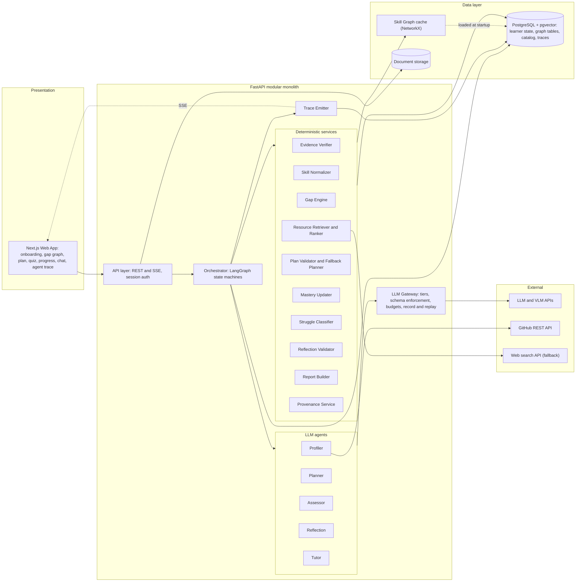
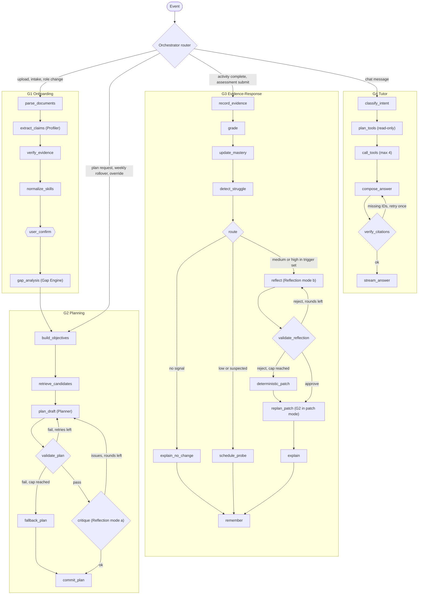
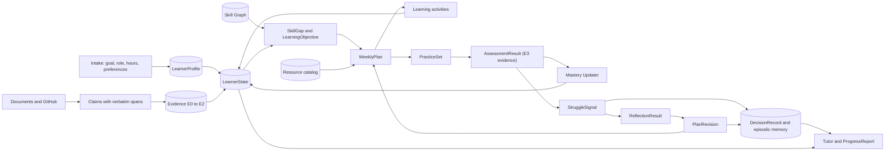
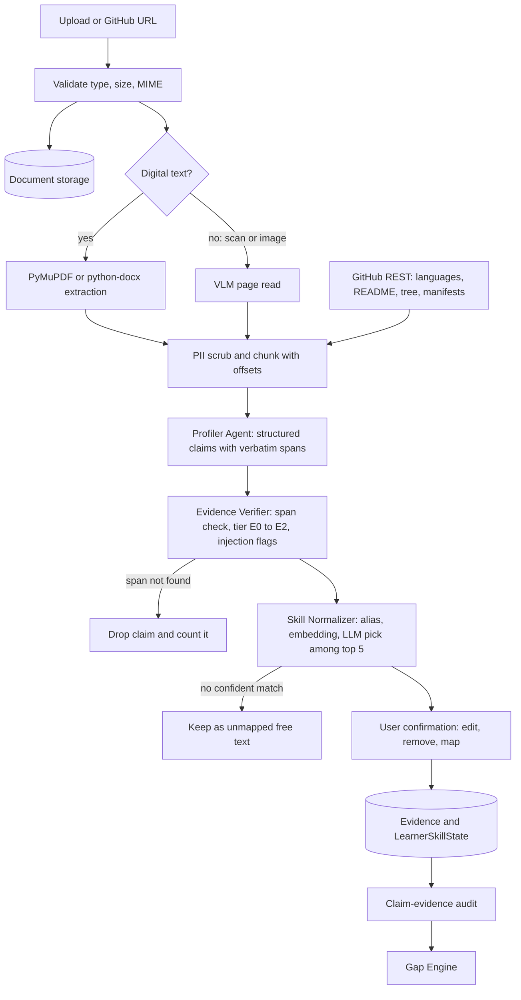
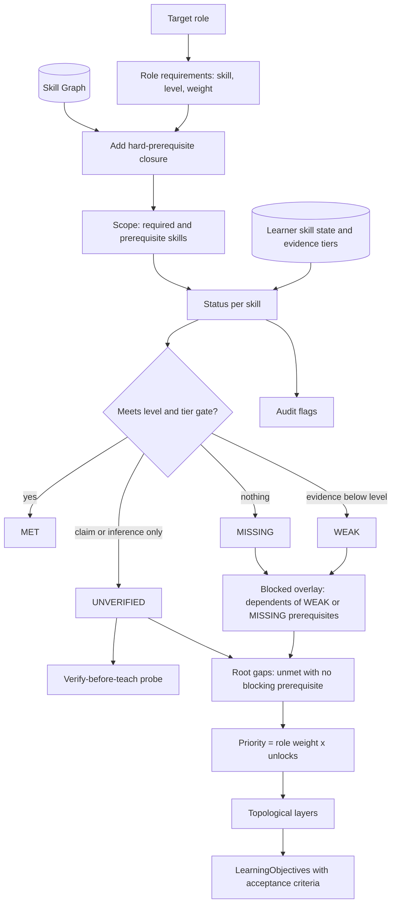
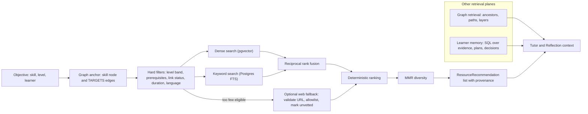
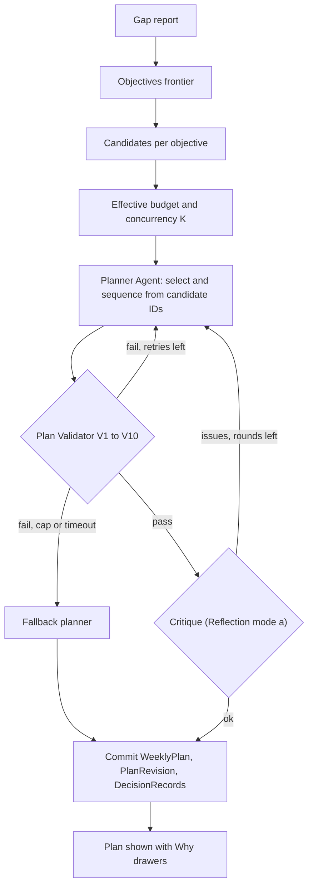
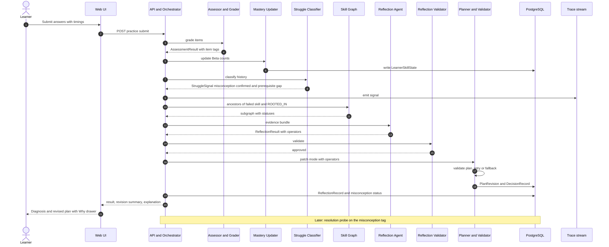
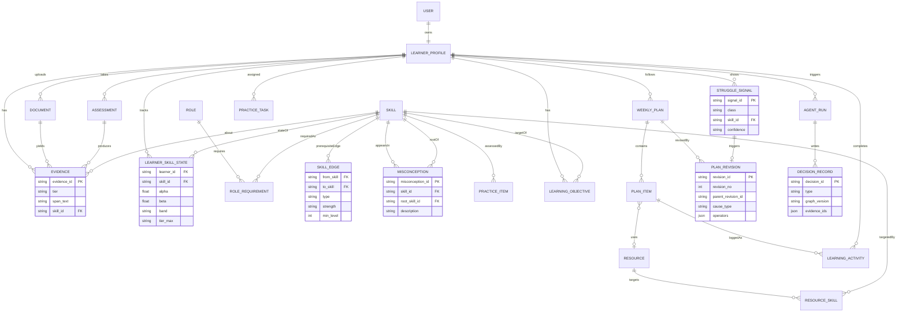
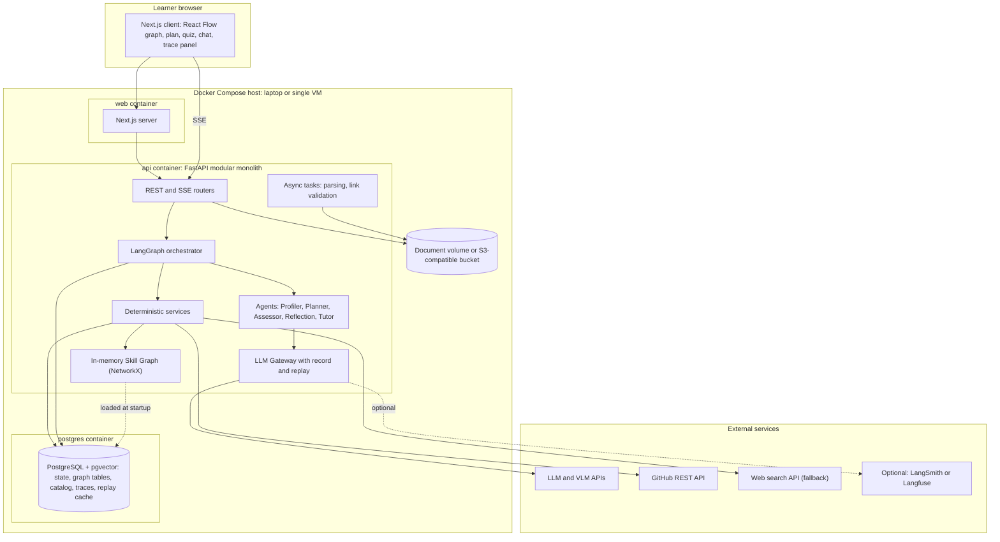

# EduPath — Complete System Design

**Document:** `EduPath_System_Design.md`
**Phase:** Architecture + System Design (follows the Gemini and Qwen ideation phase)
**Status:** Implementation-ready design, v1.0

> **A note on sources.** The four research papers were not re-read for this document. Every statement about a paper (results, methods, limitations) is taken from how the Gemini and Qwen ideation documents report it. Where a number or claim matters (for example the 35% score gain and n = 76 sample reported for the KG-RAG paper), it is flagged as "as reported" and is not used as a design premise. Every numeric threshold in this document (mastery cut-offs, load caps, ranking weights) is an **engineering default to be tuned on the evaluation set (Section 32)**. None of them is presented as an empirically derived constant.

---

## 1. Executive Summary

EduPath is an **adaptive learner-intelligence system**. It is not a chatbot that recommends courses. Its core is a closed loop:

```
Evidence → Skill Understanding → Gap Diagnosis → Personalized Planning → Learning
→ Assessment → Struggle Detection → Reflection → Re-planning → Memory Update → (repeat)
```

**What is being built.** A modular-monolith web application in which:

1. A learner provides a target role, weekly hours and preferences, and uploads a resume, project descriptions, certificates or a GitHub link.
2. A **Profiler Agent** extracts skills. Every extracted skill must be backed by a **verbatim evidence span** that code (not the LLM) verifies. Skills are normalized into a curated **Skill Graph**.
3. A deterministic **Gap Engine** diffs the learner's evidence-graded skill state against the target-role subgraph. The output is prerequisite-aware and classified: `MET / UNVERIFIED / WEAK / MISSING / BLOCKED`.
4. A **Planner Agent** proposes a weekly plan by choosing from catalog resources. A deterministic **Plan Validator** enforces prerequisites, time budget and pedagogical heuristics (CLT/ZPD-inspired). A deterministic fallback planner guarantees that a valid plan always exists.
5. An **Assessor Agent** generates practice whose wrong answers are **pre-tagged with catalogued misconceptions** that are linked in the graph to their root prerequisite skills. Diagnosis is therefore a lookup plus a repetition rule, not an LLM guess.
6. A deterministic **Struggle Classifier** separates low score, repeated misconception, missing prerequisite, excessive difficulty, overload and insufficient practice. Each class has explicit evidence requirements.
7. When the evidence is strong enough, the **Reflection Agent** diagnoses the root cause, queries the graph for the originating prerequisite, and emits a bounded set of **plan-edit operators**. The Planner applies them in patch mode, the validator checks the result, and a visible, undoable **PlanRevision** is written. The system later runs a **resolution check** to verify that the misconception is actually gone.
8. A **Tutor Agent** answers natural-language questions using read-only tools over learner state, the graph and provenance records. Every claim cites record IDs that a verifier checks.

**The ten decisions that shape everything else** (full log in Section 41):

| # | Decision |
|---|---|
| D1 | **Modular monolith** (FastAPI + Next.js + PostgreSQL). No microservices. |
| D2 | **Five LLM agents** (Profiler, Planner, Assessor, Reflection, Tutor). Everything else is a deterministic service or tool. |
| D3 | **LangGraph** for explicit, checkpointed state machines. No free-form swarms. |
| D4 | **Curated Skill Graph** (~150–250 skills, 3 roles) held in NetworkX and stored in Postgres. ESCO/O*NET are used only to seed labels and aliases, not to supply prerequisites. |
| D5 | **pgvector + Postgres FTS** for retrieval. No separate vector DB and no Neo4j. |
| D6 | **Evidence ≠ inference ≠ self-report.** Four evidence tiers (E0–E3). Only E2/E3 evidence can mark a skill `MET` at level ≥ 2. |
| D7 | **Misconception catalog in the graph.** Assessment distractors are tagged at generation time. Diagnosis is deterministic. |
| D8 | **"LLMs propose, deterministic code disposes."** Every LLM output passes a validator before touching state. Plans and revisions have deterministic fallbacks. |
| D9 | **Reflection is never silent.** Every revision is explained, evidence-linked, bounded (≤ 2 rounds) and revertible. |
| D10 | **No LoRA, RL, DKT, MCP-as-backbone, semantic answer caching or Microsoft GraphRAG.** Each is justified in Section 3.3. |

---

## 2. Problem Statement

### 2.1 Original problem statement (condensed)

Learners know the career or skill they want but not exactly what to learn next. Resources are scattered and curricula are generic. Learners repeat what they already know and cannot turn learning into a structured action plan.

### 2.2 Requirements (referenced as R1–R12 throughout)

| ID | Requirement |
|---|---|
| **R1** | Accept current skills, experience, target role, career goal. |
| **R2** | Analyze uploaded resumes, portfolios, certificates, project descriptions. |
| **R3** | Identify skill gaps between the current profile and the target role. |
| **R4** | Break gaps into structured learning objectives. |
| **R5** | Recommend relevant learning resources for each gap. |
| **R6** | Generate a personalized weekly learning plan. |
| **R7** | Create practice tasks and project ideas based on the learner's level. |
| **R8** | Track completed learning activities and update the plan dynamically. |
| **R9** | Identify areas where the learner continues to struggle. |
| **R10** | Generate periodic progress reports: skills acquired, in progress, remaining gaps, recommended next steps. |
| **R11** | Let learners ask questions about their learning journey in natural language. |
| **R12** | **Core goal:** the system continuously changes the path based on learner progress. It is not one curriculum for everyone. |

### 2.3 What "adaptive" means operationally

To keep R12 testable, this design defines an **adaptation event** precisely:

> New evidence arrives → learner state is updated (persisted) → a decision record is written → the *future* plan changes (or is explicitly kept, with a reason) → the change is explained and can be reverted.

Every adaptation event must be reproducible from stored records (Section 24) and must be visible in the trace (Section 31). If the plan does not change after new evidence, the system must be able to say why.

---

## 3. Research Inputs

### 3.1 Gemini Ideation (Document A)

**Core thesis.** A multi-agent adaptive system that unifies three research strands:

- KG-RAG for structural retrieval accuracy.
- ALIGNAgent-style distractor-based diagnosis.
- MALPP-style CLT/ZPD-constrained planning with a Reflection Agent.

Its named innovation is **"Misconception-Triggered Path Reflection."**

**Strengths to preserve**

- The clearest articulation of the *misconception-not-score* differentiator.
- A pragmatic rejection list (LoRA, DKT, RL, unconstrained swarms).
- The "role-and-rule" sequential workflow (Analytics → Planner → Reflection) bounded by JSON schemas.
- Explainable pedagogical rationale on every recommendation.
- Recognition that link validation and what-if simulation are future work.

**Weaknesses and risks**

- Claims CLT can "mathematically" bound load. Overclaimed (see the conflict in 3.3).
- Leaves the skill-graph source unspecified.
- Relies on the LLM to infer misconceptions from distractor "semantic meaning" at diagnosis time, which is unreliable unless the distractors were engineered with tags.
- Proposes a 0.85-similarity chat cache. This is dangerous for learner-specific answers.
- Silent on failure handling, security, evaluation, deployment, cost.
- Treats Neo4j/GraphRAG as essential without justifying the scale.

### 3.2 Qwen Ideation (Document B)

**Core thesis.** An "evidence-backed career-skill orchestrator" whose primary innovation is **Evidence-Backed Skill Graph Diffing** (map messy professional artifacts to a strict ontology), with autonomous struggle reflection as the secondary innovation.

**Strengths to preserve**

- The learner-graph vocabulary: `REQUIRES`, `DEMONSTRATED_BY`, `PART_OF`.
- "Track what you can *prove*, not what you say."
- The claim-vs-evidence mismatch flag in the demo (a "Full Stack" claim with only frontend evidence).
- Graph traversal for tutor explanations (Chain Rule → Derivatives → Gradient Descent → Training).
- Using an existing taxonomy instead of building an ontology from scratch.
- Perception / reasoning / action / self-correction framing.

**Weaknesses and risks**

- Implicitly assumes ESCO/O*NET provide prerequisite edges.
  - ESCO and O*NET give occupation–skill relations and skill hierarchies.
  - They do not provide the pedagogical ordering a planner needs, such as Chain Rule → Backpropagation → training a network.
  - Imported relations should be treated as candidates, not ground truth. Current API/licence terms should be checked at build time.
- Rejects "standard vector RAG" outright. Vector search is still the right tool for alias normalization and leaf-level resource retrieval.
- Recommends "GraphRAG (Microsoft)". That tool summarizes communities over large corpora and is the wrong tool for a small curated ontology.
- Treats "time-to-completion 3× expected" as a struggle signal. It is noisy (interruptions, multitasking) and only valid as corroboration.
- "Cognitive Load Capacity estimated from past tasks" is a latent quantity the system cannot measure.
- Suggests the Reflection Agent "silently" rewrites the plan. This conflicts with explainability and user control.
- Silent on evaluation metrics, failure handling, deployment and cost.

### 3.3 Reconciliation

#### 3.3.1 Decision table

| Area | Gemini Proposal | Qwen Proposal | Conflict / Difference | Final Decision | Reason |
|---|---|---|---|---|---|
| **Core product vision** | Multi-agent adaptive learning system; self-healing paths | Evidence-backed career-skill orchestrator | Tutor framing vs career-transition framing | Career-skill orchestrator whose intelligence is the *loop*. The tutor is one interface to it. | PS is about gaps → plan → adaptation, not Q&A (R3, R6, R12). |
| **Skill graph design** | Master KG, source unspecified | ESCO/O*NET-grounded skill graph with prerequisites | Qwen assumes taxonomies provide prerequisites; Gemini leaves the source open | **Small curated graph** (~150–250 skills, 3 roles). Labels and aliases seeded from ESCO/O*NET. Prerequisite edges authored offline (LLM-drafted, human-reviewed, DAG-checked). | Prerequisite ordering is the planner's backbone and must be correct and inspectable. A small graph that is right beats a large one that is noisy. |
| **Learner model** | Single JSON state object as "source of truth" | Evidence-backed learner graph with mastery probabilities | Blob vs graph; "capacity" is latent | **Normalized relational tables as source of truth.** A `LearnerState` JSON projection is assembled per run. A graph *view* is generated for UI and provenance. Store observable velocity, not "capacity". | Relational integrity, easy provenance queries, no second datastore. |
| **Agent architecture** | Analytics, Planner, Reflection, Summary/Tutor | Parser, Analytics, Gap, Planner, Reflection, Tutor | Whether analytics/gap/summary are agents | **5 LLM agents** (Profiler, Planner, Assessor, Reflection, Tutor). Gap analysis, mastery, struggle classification, validation and reporting are deterministic services. | Gap-diff, mastery update and rule-based classification are deterministic. LLMs add cost and variance with no benefit there. |
| **GraphRAG** | GraphRAG (Neo4j) for prerequisite-aware retrieval | "GraphRAG (Microsoft)" or NetworkX traversal + vector DB | Microsoft GraphRAG is designed for corpus community summarization | **Knowledge-guided retrieval** (Paper 1 style): multi-hop traversal over the curated graph, then hybrid retrieval at the leaves. | Right tool for a small curated ontology; avoids a heavy indexing pipeline. |
| **Knowledge graph store** | Neo4j | Neo4j or NetworkX | Extra service vs in-process | **Graph tables in Postgres, loaded into NetworkX at startup.** | ~200 nodes / ~800 edges fit in memory. Traversals are microseconds. Neo4j is a service to run and demo for no capability gain. Upgrade path documented. |
| **Resource retrieval** | Vector DB filtered by target nodes | GraphRAG fetch + web search | Curated vs open web | **Curated catalog is primary** (graph-anchored, hybrid-ranked). Live web search is a flagged fallback (`unvetted`, link-validated, domain-allowlisted). | Prevents hallucinated or dead links (ALIGNAgent's stated future work); keeps the demo reliable. |
| **Orchestration** | LangGraph or AutoGen | LangGraph or AutoGen | Agreement on options; neither justified | **LangGraph.** Reject AutoGen and CrewAI. | Explicit state, conditional edges, checkpointing, streaming events → the "why did it decide this?" requirement. Conversational multi-agent frameworks make control flow implicit. |
| **Reflection** | Reflection Agent intercepts the *planner output* before the user sees it (≤ 3 rounds, per MALPP) | Reflection triggered by *struggle*; rewrites plan "silently" | Two different triggers; "silent" autonomy | **One Reflection Agent, two modes:** (a) *plan critique* after deterministic validation, max 2 rounds; (b) *evidence-triggered reflection* after struggle. **Never silent:** visible, evidence-linked, undoable revision. | Both triggers are valuable. Silent rewrites destroy trust and are unauditable. |
| **Struggle detection** | Distractor-based misconception diagnosis | Time-to-completion, error patterns, "cognitive friction" | Which signal is authoritative | **Evidence-tiered deterministic classifier.** Misconception tags and repetition are primary. Time and retries are corroborating only. | Time alone is confounded. Repetition of a tagged misconception is strong evidence. |
| **Misconception detection** | LLM analyzes "semantic meaning" of chosen distractors | Analytics Agent reviews failed code/answers | Post-hoc LLM inference vs engineered tags | **Misconception catalog in the graph.** Distractors are generated *from the catalog* and carry tags. LLM used only for closed-set classification of free-text/code errors (else `unknown`). | Reliable, testable, explainable; avoids unfalsifiable LLM diagnoses. |
| **ZPD** | "Do not skip a prerequisite"; ZPD-aware sequencing | "Not too hard, not too easy" via prompt | Prompt-level vs enforced | **Enforced by the validator:** prerequisite order + difficulty ≤ current level + 1 + guidance for novices. | Prompted constraints get violated; validators do not. |
| **Cognitive Load Theory** | "Mathematical limits"; "mathematically respects CLT" | Daily load within "historical capacity" | **Overclaim.** CLT gives principles, not formulas. | **CLT as design heuristics:** time budget (a feasibility cap), new-skill concurrency cap, session chunking, worked-examples-first for novices, load reduction after overload signals. | Honest; testable as violation rates; avoids unsupported science. |
| **Memory** | Agentic memory, short-term vector memory, chat-history cache (0.85 similarity) | Graph memory of learner state | Overlap; cache is risky | **Four memories with concrete uses** (Section 21). **Reject** the semantic answer cache and vector chat memory. | Answers must reflect current learner state. A cache would serve stale or wrong-learner answers. |
| **Resume parsing** | VLM parsing | VLM + claim-gap flagging | Both rely on VLMs | **Text-first** (PyMuPDF / python-docx). VLM only for scans/images. **Verbatim-span grounding check** on every extracted skill. Claim–evidence audit. | Cheaper, more accurate on digital PDFs; grounding kills hallucinated skills. |
| **Portfolio understanding** | Not detailed | GitHub scraping | Depth | **GitHub REST API metadata** (languages, README, tree, dependency manifests) as E2 evidence. No deep code comprehension in core. | Achievable and verifiable; deep code review is a research project. |
| **Knowledge tracing** | Reject DKT; use status portraits | Mastery probability 0–1 in graph memory | Learned vs heuristic | **Beta-count heuristic per skill**, shown as bands with confidence. No learned KT. | No training data exists; must never present estimates as ground truth. |
| **RAG** | KG-RAG + chat cache | Rejects vector-only RAG entirely | Over-correction | **Hybrid:** graph for structure, vector + keyword for leaf resources and alias normalization. | Each retrieval mode used where it fits. |
| **MCP** | Optional | Tool use (not specified) | Necessity | **Not used as the backbone.** Plain typed Python tools with schema validation. Optional read-only MCP adapter is a stretch. | Single process; no cross-vendor tool ecosystem needed. MCP would add a protocol layer with no demo benefit. |
| **RL** | Reject | Reject | Agreement | **Reject.** | No reward data; heuristics and constraints are more explainable. |
| **LoRA / fine-tuning** | Reject | Reject | Agreement | **Reject.** | No dataset, adds latency, no demo value. |
| **Vector DB** | Qdrant / Pinecone | Vector DB for leaves | Extra service | **pgvector** in the same Postgres. | ≤ 10k vectors; one datastore; transactional consistency with catalog rows. |
| **Evaluation** | Cites paper metrics (APL, ALD, CLMR, KSC) | None | Undefined | **Full framework** (Section 32); MALPP metrics operationalized as validator violation rates. | The PS requires *adaptive* behavior, which needs measurement beyond "the demo looked good". |
| **Explainability** | Rationale JSON per module; struggle transparency | Provenance to graph node + resume line | Complementary | **Merged:** every decision has a `DecisionRecord` with evidence IDs, graph paths, rules fired. Tutor answers cite IDs that a verifier checks. | Provenance must be machine-checkable, not just fluent. |
| **Deployment** | Not specified | Not specified | Undefined | **Modular monolith** in Docker Compose. | One team, one demo, one process to debug. |
| **Data storage** | JSON state + vector DB | Neo4j graph memory | Polyglot persistence | **PostgreSQL for everything** (+ pgvector, FTS, JSONB). Local/S3-compatible object storage for uploads. | Minimum moving parts. |
| **Practice generation** | Distractor-aware tasks; LLM difficulty labeling | LLM code tasks executed in sandbox | Assessment modality | **Core:** MCQ with tagged distractors + rubric short-answer. **Stretch:** sandboxed code execution. | Code sandboxing is high-risk for a hackathon; MCQ with tags delivers the differentiator. |
| **Cold start** | Resume/portfolio parse | Parse + flag unsupported claims | Same goal | **Parse + audit + *verify-before-teach* probes** for claimed-but-unverified skills. | Avoids redundant beginner lessons *and* avoids trusting unverified claims. |
| **What-if simulator** | Tier C | Tier C | Agreement | **Optional**, cheap via planner `dry_run` flag designed in from the start. | Uses the same validator; near-zero incremental design cost. |
| **Summary Agent** | Separate agent | Folded into Tutor | Separate vs merged | **Deterministic `ReportBuilder` computes the report; the Tutor's narration path writes prose.** No separate agent. | Numbers must not be LLM-generated. |
| **Demo scenario** | Optical flow / vector-math misconception | Calculus chain rule → backprop | Different examples | **Chain rule → backpropagation** as primary; optical flow as a backup scenario. | Cleaner prerequisite edge; more universal; easy to author a tagged item bank. |

#### 3.3.2 Agreements (adopted as-is)

- Multi-agent, explicit-workflow (not swarm) architecture.
- Resume/portfolio ingestion for cold start.
- Prerequisite-aware graph for gap analysis and sequencing.
- Reflection loop with a bounded number of rounds.
- Explainable rationales on every recommendation.
- Reject LoRA, RL, unconstrained agent swarms, and free-form Auto-GPT behavior.

#### 3.3.3 Over-engineering removed

- Neo4j and a separate vector DB (two extra services for < 10k vectors and ~200 nodes).
- Microsoft GraphRAG indexing.
- Real-time per-learner fine-tuning.
- Separate Summary, Analytics and Skill-Gap *agents* where deterministic code suffices.
- Semantic answer caching.
- A full ESCO import.
- Forgetting curves and peer-collaboration graphs (moved to Future).

#### 3.3.4 Gaps both documents leave open (added by this design)

1. A **mastery model** with explicit provenance classes (both are vague).
2. A **misconception catalog** tied to the graph, so diagnosis is deterministic.
3. **Deterministic validators and fallbacks** so LLM failure cannot break the demo.
4. **Resource catalog governance** (metadata, link validation, unvetted tier).
5. **Termination, rollback and resolution checks** for reflection.
6. **Security** (prompt injection in documents, sandboxing, learner isolation).
7. **Evaluation, observability, cost/latency budgets, failure modes.**
8. **API contracts and a data model.**
9. **Demo determinism strategy** (record/replay, scripted learner).

---

## 4. Final Feature Scope

Legend: **CORE** = required for the PS. **ADVANCED** = differentiators. **OPTIONAL** = useful, buildable if time permits. **FUTURE** = do not implement now.

### 4.1 CORE

| ID | Feature | PS Req | Research idea | Architectural component |
|---|---|---|---|---|
| C1 | Learner intake (skills, experience, role, goal, weekly hours, modality preferences) | R1 | Cold-start profiling (Paper 4 gap) | Intake API, `LearnerProfile` |
| C2 | Document ingestion + evidence-backed skill extraction | R2 | Entity extraction into learner portraits (Paper 2), cold-start bypass (Paper 4) | Profiler Agent, Evidence Verifier, Skill Normalizer |
| C3 | Curated Skill Graph with role competency requirements | R3, R4 | KG construction & validation (Paper 1); ontology (Paper 2) | Skill Graph Service |
| C4 | Prerequisite-aware gap analysis with statuses and ordering | R3 | Skill-gap diagnosis (Paper 3); prerequisite structure (Papers 1, 2) | Gap Engine |
| C5 | Structured learning objectives with acceptance criteria | R4 | Path planning (Paper 4) | Gap Engine + Planner |
| C6 | Gap-driven resource recommendation | R5 | Recommender tied to diagnosed deficiencies (Paper 3); KG-guided retrieval (Paper 1) | Resource Retriever/Ranker |
| C7 | Weekly plan generation with deterministic validation and fallback | R6 | CLT/ZPD-constrained planning (Paper 4) | Planner Agent, Plan Validator |
| C8 | Practice tasks + project ideas at the learner's level | R7 | Distractor-aware assessment (Paper 3) | Assessor Agent |
| C9 | Activity tracking; dynamic plan updates | R8, R12 | Status portraits (Paper 2); reflection loop (Paper 4) | Mastery Updater, Orchestrator |
| C10 | Struggle identification | R9 | Diagnostic reasoning (Paper 3) | Struggle Classifier |
| C11 | Progress report (acquired / in progress / remaining / next steps) | R10 | Summary Agent (Paper 3) | Report Builder + Tutor narration |
| C12 | Natural-language Q&A grounded in learner state and graph | R11 | KG-RAG (Paper 1) | Tutor Agent + Provenance Service |

### 4.2 ADVANCED

| ID | Feature | PS Req | Research idea | Component |
|---|---|---|---|---|
| A1 | **Misconception-tagged assessment** (distractors carry catalog tags) | R7, R9 | Distractor analysis (Paper 3) | Assessor Agent, misconception catalog |
| A2 | **Misconception-triggered reflection + patch replanning** | R8, R9, R12 | Reflection Agent (Paper 4) + diagnosis (Paper 3) | Reflection Agent, plan-edit operators |
| A3 | **Provenance / "Why?" for every decision** | R11 | Explainable planning (Paper 4) | Provenance Service, `DecisionRecord` |
| A4 | **Verify-before-teach probes** for claimed-but-unverified skills | R2, R3 | Cold-start (Paper 4 gap) | Gap Engine + Assessor |
| A5 | **Claim–evidence audit** ("claims Full Stack, evidence shows frontend only") | R2, R3 | Qwen ideation | Evidence Verifier, Gap Engine |
| A6 | **Live agent trace panel** | (demo) | Explainability | Trace Emitter, SSE |
| A7 | **Plan critique loop** (deterministic → LLM critic, ≤ 2 rounds) | R6 | MALPP Reflection Agent | Reflection Agent (mode a) |
| A8 | **Misconception resolution check** (verified closure, not module completion) | R8, R9 | Evaluation gap (Gemini §5) | Struggle Classifier + Assessor |

### 4.3 OPTIONAL / STRETCH

| ID | Feature | Notes |
|---|---|---|
| O1 | What-if planner (`dry_run` with different hours) | Nearly free given validator + `dry_run` flag |
| O2 | Sandboxed code-execution tasks | High-risk. Use an isolated runner with no network. |
| O3 | GitHub deep evidence (dependency manifests, commit activity) | Basic repo metadata is included in C2 |
| O4 | Live web resource fallback with link validation | Flagged `unvetted` |
| O5 | Resource feedback (thumbs) feeding ranking | Small ranking term |
| O6 | Read-only MCP adapter over learner tools | Integration demo only |

### 4.4 FUTURE (not implemented)

Forgetting-curve / spaced repetition; learned knowledge tracing (once data exists); automated KG construction from web scrapes; peer/social learning; fine-tuned models; RL planners; multi-role comparison; certificate verification against issuers; calibrating CLT parameters from cohort data.

---

## 5. Architectural Principles

| # | Principle | Consequence in this design |
|---|---|---|
| P1 | **LLMs propose, deterministic code disposes.** | Every LLM output is schema-validated and rule-validated before it changes state. |
| P2 | **Use an LLM only where language understanding or generation is needed.** | Gap diff, mastery update, struggle classification, ranking, validation and reporting have no LLM in the decision path. |
| P3 | **Evidence, inference and self-report are never equivalent.** | Four tiers (E0–E3). Only E2/E3 can satisfy level ≥ 2 requirements. |
| P4 | **Explicit state over emergent behavior.** | LangGraph state machines, typed schemas, IDs instead of free text. |
| P5 | **Every decision is inspectable.** | `DecisionRecord` + trace events for each state transition. |
| P6 | **Bounded autonomy.** | Hard caps on retries, reflection rounds, tokens and runtime. User can undo any revision. |
| P7 | **Graceful degradation.** | Each LLM-dependent step has a deterministic or cached fallback. |
| P8 | **Smallest coherent architecture.** | One process, one database, five agents. |
| P9 | **No unsupported science.** | Theories are heuristics and validation criteria; parameters are labeled tunable defaults. |
| P10 | **Demo determinism without faking.** | Record/replay LLM gateway, pre-validated item bank and a scripted-learner mode, while the live path stays real. |

---

## 6. High-Level Architecture

**Style:** modular monolith. One FastAPI process hosts the API layer, the LangGraph orchestrator, the agents and the deterministic services. One PostgreSQL instance (with pgvector) holds all state. The Next.js frontend talks to the API over REST and Server-Sent Events (SSE). Diagram 1 (Section 36) shows this.

### 6.1 Layers

| Layer | Contents | Trust |
|---|---|---|
| **L0 Presentation** | Next.js app: onboarding, evidence review, gap graph, weekly plan, quiz, progress, chat, agent trace panel | Untrusted input |
| **L1 API** | FastAPI routers, session auth, request validation, SSE streaming | Boundary |
| **L2 Orchestration** | LangGraph graphs (Onboarding, Planning, Evidence-Response, Tutor) with a Postgres checkpointer | Trusted code |
| **L3 Agents (LLM)** | Profiler, Planner, Assessor, Reflection, Tutor | LLM output untrusted until validated |
| **L4 Deterministic services** | Skill Normalizer, Evidence Verifier, Skill Graph Service, Gap Engine, Resource Retriever/Ranker, Plan Validator, Mastery Updater, Struggle Classifier, Report Builder, Provenance Service, Trace Emitter | Trusted code |
| **L5 Data** | Postgres (learner state, graph tables, catalog, traces, vectors), in-memory graph cache, document storage | Trusted |
| **L6 External** | LLM/VLM APIs, GitHub REST API, web-search API (fallback) | Untrusted |

### 6.2 The closed loop mapped to responsibilities

| Loop stage | Responsible component(s) | Nature |
|---|---|---|
| **OBSERVE** | Document pipeline (Profiler, Evidence Verifier); activity logging; assessment submission | LLM + deterministic |
| **UNDERSTAND** | Skill Normalizer; Mastery Updater; `LearnerState` assembly | Deterministic (LLM only for ambiguous normalization) |
| **DIAGNOSE** | Gap Engine; Struggle Classifier | Deterministic |
| **PLAN** | Resource Retriever/Ranker; Planner Agent; Plan Validator; Reflection Agent (critique mode) | Hybrid |
| **ACT** | Learner performs activities; Assessor generates practice | Human + LLM |
| **EVALUATE** | Grader (MCQ deterministic; rubric short-answer via small LLM); Mastery Updater | Mostly deterministic |
| **REFLECT** | Reflection Agent (evidence mode) + Reflection Validator | LLM + deterministic |
| **REMEMBER** | Postgres writes: skill state, evidence, misconceptions, revisions, decision records | Deterministic |
| **RE-PLAN** | Planner Agent in patch mode; Plan Validator; deterministic fallback | Hybrid |

---

## 7. Component Architecture

| Component | Kind | LLM? | Responsibility | Inputs → Outputs |
|---|---|---|---|---|
| **Web UI** | Frontend | – | Renders state; collects intake, uploads, quiz answers, chat | user actions → API calls; SSE events → UI |
| **API Layer** | Service | – | AuthN/Z, validation, rate limits, SSE; injects `learner_id` from the session (never from LLM args) | HTTP → orchestrator calls |
| **Orchestrator** | Service | – | Runs LangGraph graphs, checkpoints, enforces caps (recursion, tokens, wall-clock) | events → graph runs |
| **LLM Gateway** | Service | – | Model routing by tier, structured-output enforcement, retries, token/cost budget, **record/replay cache** for demo | prompt+schema → validated JSON |
| **Profiler Agent** | Agent | Yes (mid/strong; VLM fallback) | Extract skills and experience from documents as schema-conformant claims with verbatim spans | doc text/images → `ExtractedClaims` |
| **Evidence Verifier** | Service | No | Verify each span exists in the source; assign evidence tier; strip PII; flag injection patterns | claims + doc → `Evidence[]` |
| **Skill Normalizer** | Service | Small LLM only on ambiguity | Map extracted labels → graph `skill_id` (alias exact → embedding NN → LLM pick among top-5 → `unmapped`) | label → `skill_id` + confidence |
| **Skill Graph Service** | Service | No | Load/validate graph; traversals (ancestors, descendants, paths, topological layers) | queries → subgraphs |
| **Gap Engine** | Service | No | Diff role subgraph vs learner state; statuses; ordering; objectives | `LearnerState` + role → `SkillGap[]`, `LearningObjective[]` |
| **Resource Retriever/Ranker** | Service | No | Graph-anchored hard filter → hybrid retrieval → deterministic ranking + MMR diversity | objective + learner → ranked `ResourceRecommendation[]` |
| **Planner Agent** | Agent | Yes (strong) | Select/sequence from candidate set; write rationale; realize edit operators in patch mode | candidates + constraints → `WeeklyPlan` draft |
| **Plan Validator** | Service | No | Enforce V1–V10 rules; produce structured violations | plan → pass/fail + violations |
| **Fallback Planner** | Service | No | Greedy, priority-ordered, budget-bounded plan that satisfies all hard rules | candidates + constraints → valid `WeeklyPlan` |
| **Assessor Agent** | Agent | Yes (strong for generation; small for validation/grading) | Generate practice items (from misconception catalog), project ideas; grade short answers by rubric | skill + level → `PracticeSet`; answers → `AssessmentResult` |
| **Mastery Updater** | Service | No | Beta-count update per skill; band/confidence; tier gating | `AssessmentResult`/evidence → `SkillState` |
| **Struggle Classifier** | Service | No | Rule-based classification with evidence requirements and confidence | history → `StruggleSignal[]` |
| **Reflection Agent** | Agent | Yes (strong) | Mode (a) plan critique; mode (b) root-cause analysis → edit operators | evidence bundle → `ReflectionResult` |
| **Reflection Validator** | Service | No | Check that root cause is a graph ancestor; evidence IDs exist and support the class; agreement with classifier | `ReflectionResult` → approved / rejected |
| **Tutor Agent** | Agent | Yes (strong; streaming) | Answer questions using read-only tools; cite IDs | question → grounded answer |
| **Report Builder** | Service | No | Compute acquired / in-progress / remaining / struggle / next steps from state | learner → `ProgressReport` (data) |
| **Provenance Service** | Service | No | Create/resolve `DecisionRecord`s; verify citations in tutor answers | IDs ↔ records |
| **Trace Emitter** | Service | No | Emit structured events per step to DB and SSE | events → `AgentRun` rows + stream |
| **Catalog Tools (offline)** | Scripts | Optional LLM | Seed graph, enrich resource metadata, validate links, build item bank | files → DB rows |

---

## 8. Agent Architecture

### 8.1 Role-by-role decision (agent vs tool vs service vs function)

| Candidate role | Decision | Reason |
|---|---|---|
| Learner/Profile Agent | **Agent** ("Profiler") | Unstructured text/images → structured claims needs language/vision understanding. |
| Skill-Gap Agent | **Deterministic service** ("Gap Engine") | It is a graph diff over typed data. An LLM would add variance and could invent gaps. The LLM only *narrates* the result. |
| Resource Retrieval Agent | **Deterministic service** + tools | Retrieval and ranking are computable; the LLM's role is choosing/sequencing inside the Planner. |
| Planning Agent | **Agent** ("Planner") | Sequencing, rationale and project/task framing benefit from an LLM, but only inside validator-enforced bounds. |
| Practice Generation Agent | **Agent** ("Assessor") | Item and distractor generation requires language generation, constrained by the misconception catalog. |
| Assessment/Evaluation Agent | **Merged into Assessor + deterministic grader** | MCQ grading is deterministic. Only rubric short-answer needs a (small) LLM. |
| Struggle Detection Agent | **Deterministic service** ("Struggle Classifier") | Requires explicit evidence thresholds that must be auditable. |
| Reflection Agent | **Agent** | Root-cause narrative and choosing among remediation operators needs reasoning. It is bounded by graph-checked outputs. |
| Tutor / Q&A Agent | **Agent** | Natural-language interface with tool-calling. |
| Progress Reporting Agent | **Function** ("Report Builder") + Tutor narration | Numbers must not be LLM-generated. |

**Result: five LLM agents, ten deterministic services.**

### 8.2 Agent specifications

#### A1 — Profiler Agent
- **Why it exists:** convert messy documents into structured, grounded claims (R2).
- **Why LLM:** free-form text, variable layouts, implicit skill demonstrations ("built a YOLOv8 detector" ⇒ object detection).
- **Why simpler is insufficient:** keyword matching misses implicit skills and contexts.
- **Tools:** `parse_document`, `github_repo_summary`.
- **Output:** `ExtractedClaims` (skill label, claimed level cue, context, verbatim span, source doc).
- **Guardrails:** documents are wrapped as untrusted data; output schema only; no tools with side effects; span verification by code; PII scrubbed before the call.
- **Model tier:** mid/strong with vision fallback; temperature 0.

#### A2 — Planner Agent
- **Why it exists:** turn objectives and candidates into an ordered, explainable weekly plan (R6); realize patch edits (R8).
- **Why LLM:** balances competing considerations (order, variety, modality, rationale) and writes learner-specific task framing.
- **Why simpler is insufficient:** a greedy planner is valid but generic and unexplained. It is kept as the fallback.
- **Tools:** none with side effects. Reads a *pre-built candidate set* (IDs only).
- **Output:** `WeeklyPlan` referencing only candidate IDs.
- **Guardrails:** Plan Validator; ≤ 2 retries with structured violation feedback; fallback planner.

#### A3 — Assessor Agent
- **Why it exists:** practice tasks and project ideas at the learner's level (R7) and the evidence source for struggle diagnosis (R9).
- **Why LLM:** generating plausible items and distractors; interpreting short answers against a rubric.
- **Guardrails:** distractors must be generated *from* catalogued misconceptions; blind-solver validation (a small model answers without seeing the key; must match exactly one key); items cached in an item bank and reused.
- **Model tier:** strong for generation; small for validation and grading.

#### A4 — Reflection Agent
- **Why it exists:** critique the path when new evidence says it is no longer appropriate; identify root cause; propose bounded edits (R8, R9, R12).
- **Why LLM:** synthesizes multi-signal evidence into a causal hypothesis and chooses among remediation strategies.
- **Why simpler is insufficient:** rules can classify the *type* of struggle, but choosing remediation (e.g., worked example first vs visual refresher vs split resource) and writing the learner-facing rationale needs reasoning.
- **Modes:** (a) *Plan critique* (pre-presentation): soft pedagogical checks after the deterministic validator passes; ≤ 2 rounds. (b) *Evidence reflection* (post-struggle).
- **Output:** `ReflectionResult` with edit operators. It cannot free-form rewrite the plan.
- **Guardrails:** Reflection Validator; deterministic classifier has priority in a disagreement.

#### A5 — Tutor Agent
- **Why it exists:** natural-language interface to the learning journey (R11).
- **Tools (read-only):** `get_learner_state`, `get_gaps`, `get_current_plan`, `get_plan_revisions`, `get_evidence(skill)`, `explain_skill_path(skill)`, `search_resources(skill)`, `get_progress`, `get_decision(id)`.
- **Guardrails:** cannot mutate the plan (it may only *propose* an override request that the user confirms); citation verifier; scope refusal for off-topic requests; max 4 tool steps.

### 8.3 Orchestration framework evaluation

| Option | Strengths | Weaknesses for this project | Verdict |
|---|---|---|---|
| **LangGraph** | Explicit graph and conditional edges; typed shared state; checkpointing/resume; streaming events; easy retry/limit semantics | Some learning curve; LangChain ecosystem weight | **Selected** |
| AutoGen | Conversational multi-agent patterns | Control flow emerges from dialogue; harder to guarantee termination and inspectability | Rejected |
| CrewAI | Fast role-based prototyping | Less control over state transitions, retries and validation hooks | Rejected |
| Custom state machine | Total control; no dependency | Reimplements checkpointing/streaming; slower to build | Fallback option if LangGraph blocks the team |

---

## 9. Agent State Machine / Workflow

### 9.1 Four graphs, four entry points

| Graph | Entry trigger | Purpose | Terminates when |
|---|---|---|---|
| **G1 Onboarding** | Intake + document upload (or role change) | Profile → verify → normalize → confirm → gap analysis | Gap report stored and user confirmation received (or skipped) |
| **G2 Planning** | After G1; weekly rollover; user override; replan request | Objectives → candidates → plan → validate → critique → present | A valid plan is stored (LLM or fallback) |
| **G3 Evidence-Response** | Activity completion or assessment submission | Update mastery → classify struggle → (reflect → replan) → explain → remember | State updated and either "no change" recorded or a revision stored |
| **G4 Tutor** | Chat message | Route → tool calls → answer → citation verify | Verified answer or refusal |

See Diagram 2 (Section 36).

### 9.2 Shared run state

Every graph run carries a typed `RunState` (persisted by the checkpointer):

```
RunState:
  run_id, graph, learner_id, trigger (event ref)
  learner_state_snapshot   # LearnerState at run start (read-only)
  working: { claims, evidence, gaps, objectives, candidates, plan_draft,
             validation, assessment_result, signals, reflection, operators }
  counters: { llm_calls, tokens, retries, reflection_rounds, planner_attempts }
  status: running | needs_user | completed | degraded | failed
  decision_record_ids[]
```

Agents read from and write to `working` **only via validated schemas**. Learner-persistent changes are written by services at explicit commit nodes, never by agents directly.

### 9.3 G1 Onboarding — nodes and transitions

| Node | Type | On success | On failure |
|---|---|---|---|
| `parse_documents` | service | → `extract_claims` | Unreadable → VLM fallback; still fails → ask user for text paste; continue with intake-only claims |
| `extract_claims` | Profiler | → `verify_evidence` | Schema fail → retry ×2 → skip document with warning |
| `verify_evidence` | service | → `normalize_skills` | Spans not found → claim dropped and counted (`dropped_unverified`) |
| `normalize_skills` | service | → `user_confirm` | Low confidence → `unmapped` list (user can map) |
| `user_confirm` | human-in-the-loop | → `gap_analysis` | User edits/removes claims; timeout → continue with confirmed subset |
| `gap_analysis` | Gap Engine | → G2 | Missing role data → error to user ("role not supported"); no LLM involved |

### 9.4 G2 Planning — nodes and transitions

| Node | Type | Behavior |
|---|---|---|
| `build_objectives` | Gap Engine | Turn frontier gaps into `LearningObjective`s |
| `retrieve_candidates` | Retriever/Ranker | Candidate resources + practice per objective (IDs, scores) |
| `plan_draft` | Planner | Propose plan (or patch, if given operators) |
| `validate_plan` | Validator | Pass → `critique`; fail → `plan_draft` with violation list (attempt ≤ 2); still failing → `fallback_plan` |
| `fallback_plan` | Fallback Planner | Always produces a valid plan; marks `degraded=true` in the trace |
| `critique` | Reflection (mode a) | Soft checks; if issues → `plan_draft` (round ≤ 2); otherwise → `commit_plan` |
| `commit_plan` | service | Write `WeeklyPlan`, `PlanRevision`, `DecisionRecord`s |

**Termination:** at most 2 validation retries + 2 critique rounds. The worst case is 4 planner calls before fallback. The wall-clock cap is 45 s, after which the fallback plan is used.

### 9.4.1 Retry and failure policy (all graphs)

- Schema-validation failure → retry with the error message, max 2 times.
- Provider timeout/5xx → exponential backoff, max 2 times → replay cache (if a recorded response exists) → degraded path.
- Any loop counter reaching its cap → degrade to the deterministic path and mark the run `degraded`. Never loop silently.

### 9.5 G3 Evidence-Response — nodes and transitions

| Node | Type | Behavior |
|---|---|---|
| `record_evidence` | service | Persist activity/attempt with timing and retries |
| `grade` | Assessor/deterministic | MCQ deterministic; short-answer via rubric (small LLM) |
| `update_mastery` | Mastery Updater | Update Beta counts, band, confidence |
| `detect_struggle` | Struggle Classifier | Produce `StruggleSignal[]` with class + confidence + evidence IDs |
| `route` | conditional | No signal → `explain_no_change`; low confidence → `schedule_probe`; medium/high in the trigger set → `reflect` |
| `reflect` | Reflection (mode b) | Produce `ReflectionResult` |
| `validate_reflection` | Reflection Validator | Approve / reject (→ reflect, round ≤ 2) / reject-final (→ deterministic patch) |
| `replan_patch` | G2 (patch mode) | Apply operators; validate; commit revision |
| `explain` | Provenance + small LLM | Learner-facing explanation from the decision record |
| `remember` | service | Write misconception records, reflection record, revision, mastery |

**Termination:** at most 2 reflection rounds and at most 1 revision per (learner, skill) per cooldown window (default 24 h) unless new assessed evidence arrives.

### 9.6 G4 Tutor

`classify_intent` (small model or rule-based) → `plan_tools` → `call_tools` (≤ 4 steps) → `compose_answer` → `verify_citations` → stream. If verification fails, the answer is regenerated once with the missing IDs; otherwise a conservative answer is returned ("here is what the records show…").

---

## 10. Learner Model

### 10.1 Design stance

The learner model is the **central evolving state**. Its source of truth is a set of normalized Postgres tables. A `LearnerState` JSON projection is assembled per run for agents. A graph view (learner → skills → evidence) is generated for UI and provenance.

### 10.2 Three classes of information (never equivalent)

| Class | Definition | Examples | How the system may use it |
|---|---|---|---|
| **Self-reported** | What the learner *claims* | Intake form skill list; skills listed on a resume without context | Priors and probe scheduling. Never satisfies a requirement by itself. |
| **Evidence** | What the system can *point to* | Resume project context describing usage (E1); GitHub repo/code artifact or certificate (E2); in-system assessment results (E3) | Satisfies requirements per the tier gate (Section 12.3) |
| **Inference** | What the system *estimates* | Implied prerequisite (React ⇒ JavaScript, low weight); mastery estimate from few observations | Only for prioritization and probe selection. Always labeled as an estimate. |

### 10.3 Evidence tiers

| Tier | Meaning | Source | Strength (default prior pseudo-count) |
|---|---|---|---|
| **E0** | Self-reported / listed only | Intake form, resume skills list | Very weak (0.5 successes / 1.0 trials) |
| **E1** | Documented in context | Resume project/experience that describes concrete use | Weak (1.0 / 1.5) |
| **E2** | Artifact-verifiable | GitHub repo metadata/README/manifests; certificate with issuer; portfolio artifact | Moderate (2.0 / 3.0) |
| **E3** | Assessed in-system | MCQ/short-answer/probe results | Strongest; accumulates per item |

(Priors are tunable defaults. Their purpose is that a handful of assessed items can quickly outweigh documents.)

### 10.4 Mastery estimate

- Per (learner, skill) keep Beta counts `(α, β)`. `mastery = α / (α + β)`. `n_obs` = number of assessed items.
- Update on an assessed item: correct → `α += w`; incorrect → `β += w`, where `w` depends on item difficulty (defaults: easy 0.7, medium 1.0, hard 1.3 for correct; the reverse for incorrect, since missing an easy item is more informative of weakness).
- **Display as bands with confidence, never as ground truth:**

| Band | Rule (defaults) |
|---|---|
| Unknown | `n_obs = 0` and tier ≤ E1 |
| Learning | mastery < 0.55 |
| Developing | 0.55 ≤ mastery < 0.75 |
| Proficient | mastery ≥ 0.75 and `n_obs ≥ 3` |

- **Confidence** = `low / medium / high` from `n_obs` (0–1 / 2–3 / ≥ 4) and consistency across items.
- **Level mapping** (for role requirements): Level 1 (Foundational), Level 2 (Working), Level 3 (Proficient). Defaults: L1 ≥ 0.50, L2 ≥ 0.70, L3 ≥ 0.85, each with a minimum evidence tier (L1 ≥ E1, L2 ≥ E2 or E3, L3 = E3) and `n_obs ≥ 3` for assessed-only satisfaction.

### 10.5 What the model contains

| Group | Fields (conceptual) |
|---|---|
| **Profile** | `learner_id`, `target_role_id`, `career_goal` (text, self-reported), `experience_summary` (self-reported), `weekly_hours`, `preferences` (modality order, language, session length), `constraints` (fixed days off) |
| **Skill state** (per skill) | `claims[]` (E0), `evidence[]` (E1–E3 refs), `mastery{alpha,beta,estimate,band,confidence,n_obs}`, `tier_max`, `status_for_role` (derived), `open_misconceptions[]`, `last_assessed_at` |
| **Misconceptions** | `misconception_id`, `status` (suspected / confirmed / remediating / resolved / persistent), `evidence_ids`, `first_seen`, `resolution_probe_id` |
| **Activity history** | completed items, actual minutes, retries, self-rating (optional), links to resources |
| **Practice history** | attempts, per-item outcomes with chosen option and tag, timing |
| **Struggle signals** | open/closed signals with class, confidence, evidence IDs |
| **Velocity (observed)** | rolling planned-vs-actual time ratio, completion rate, items/week |
| **Path** | current plan and revision number; past plans; reasons for changes (`DecisionRecord` IDs) |

### 10.6 Read/write matrix

| Component | Reads | Writes (via validated commit nodes) |
|---|---|---|
| Profiler | documents, intake | none (emits claims) |
| Evidence Verifier / Normalizer | claims, graph | `Evidence`, `LearnerSkillState` (E0–E2) |
| Gap Engine | learner state, graph | `SkillGap`, `LearningObjective` |
| Planner / Validator | objectives, candidates, velocity | `WeeklyPlan`, `PlanRevision` |
| Assessor | skill state, item bank, catalog | `PracticeSet`, `Assessment` (results) |
| Mastery Updater | assessment | `LearnerSkillState` (E3, mastery) |
| Struggle Classifier | practice/activity history | `StruggleSignal`, `Misconception` |
| Reflection | evidence bundle | `ReflectionRecord`, operators |
| Tutor | everything (read-only) | none |

---

## 11. Knowledge Graph Design

### 11.1 Decision: what exists in the graph (and what does not)

The **shared Skill Graph** is a curated, read-mostly structure. Learner-specific data live in relational tables and are *projected* as an overlay when needed (Section 12). This keeps the shared graph small, reviewable and cacheable.

### 11.2 Node types (final)

| Node | Key properties | Purpose |
|---|---|---|
| **Role** | `role_id`, `title`, `description`, `aliases` | Target of gap analysis |
| **Skill** | `skill_id`, `label`, `kind` (concept / tool / practice), `area`, `aliases[]`, `description`, `assessable` | Atomic learnable capability (includes what other systems call "Concept") |
| **Misconception** | `misconception_id`, `description`, `signature` (how it manifests), `severity` | Catalogued erroneous mental model; links assessment distractors to root causes |
| **Resource** | `resource_id`, metadata (Section 15) | Learning material |
| **PracticeItem** | `item_id`, `type`, `difficulty`, `stem`, `options[]{text, is_key, misconception_id?}` | Item bank entries |

**Deliberately not nodes:** Certificate (an evidence *type*), Learning Objective (a per-learner planning artifact stored relationally), Learner/Evidence (learner overlay).

### 11.3 Edge types (final)

| Edge | From → To | Properties | Used for |
|---|---|---|---|
| `PREREQUISITE_OF` | Skill → Skill | `strength` (hard / soft), `min_level` (default 1) | Ordering, blocked detection, root-cause tracing |
| `PART_OF` | Skill → Skill (area/parent) | – | Hierarchy, UI grouping, normalization disambiguation |
| `REQUIRES` | Role → Skill | `required_level` (1–3), `weight` (core 3 / important 2 / nice 1) | Target-role subgraph |
| `TARGETS` | Resource → Skill | `level_from`, `level_to` | Gap-anchored retrieval |
| `ASSESSES` | PracticeItem → Skill | `primary` (bool) | Assessment ↔ skill mapping |
| `MISCONCEPTION_OF` | Misconception → Skill | – | Where the misconception appears |
| `ROOTED_IN` | Misconception → Skill | – | Root-cause skill (usually a prerequisite) |
| `REMEDIATED_BY` | Misconception → Resource | – | Targeted remediation candidates |
| `RELATED_TO` | Skill ↔ Skill | `weight` | **Explanation and normalization only. Never used in planning.** |

Every edge carries `source` (`curated` / `llm_draft_reviewed` / `imported_candidate`) and `reviewed_by`.

### 11.4 How the graph supports each function

| Function | Graph mechanism |
|---|---|
| **Gap detection** | Role → `REQUIRES` → skills; expand transitively over hard `PREREQUISITE_OF`; compare each node with learner state |
| **Prerequisite reasoning** | Ancestors of a failed skill; topological layers; "blocked by" = nearest unmet ancestors |
| **Resource recommendation** | `TARGETS` edges anchor candidates to the exact gap node and level band |
| **Explanations** | Path queries ("chain rule → backpropagation → training neural networks"), `REQUIRES` for "why is this needed for your role" |
| **Adaptation** | `Misconception -ROOTED_IN→ Skill` gives the root-cause node; `REMEDIATED_BY` gives targeted remediation |
| **Normalization** | Aliases + `PART_OF` context disambiguate labels |

### 11.5 Construction and curation (offline, Phase 3)

1. **Scope:** 3 roles (e.g., Machine Learning Engineer, Data Analyst, Backend Developer). ~150–250 skills.
2. **Seed** skill labels and aliases from ESCO/O*NET (as *candidates*). Verify data terms and API availability at build time.
3. **Draft** prerequisite edges and misconception entries with an LLM. Human-review every edge (approx. 2–3 team hours for the demo role). Mark `reviewed_by`.
4. **Validate** invariants automatically:
   - The hard-prerequisite graph is a DAG (cycle check).
   - Every role-required skill has ≥ 1 resource per level band.
   - Every `assessable` skill has ≥ 6 items (mixed difficulty).
   - Every misconception has `MISCONCEPTION_OF` and (where relevant) `ROOTED_IN`.
   - No orphan skills.
5. **Version** the graph (`graph_version`) and record it in every `DecisionRecord`.

**Failure mode if a role is missing:** the API returns "role not supported". The system does not invent a graph at runtime.

---

## 12. Evidence Graph (Learner Overlay)

### 12.1 Graph layering (answering "global vs role vs learner graph")

| Layer | What | Stored | Mutability |
|---|---|---|---|
| **Global Skill Graph** | Skills, prerequisites, roles, resources, misconceptions | Postgres graph tables → NetworkX | Curated; versioned |
| **Target-role subgraph** | Role's required skills plus prerequisite closure | *Derived view* (not stored) | Recomputed on demand |
| **Learner overlay** | Claims, evidence, skill state, misconceptions, activity | Relational tables | Continuously updated |

**Gap detection** operates *between* the target-role subgraph and the learner overlay (Section 13).

### 12.2 Overlay relationships

```
Learner ─CLAIMS(E0)────────────▶ Skill
Learner ─HAS_EVIDENCE─▶ Evidence ─SUPPORTS(tier)─▶ Skill
Evidence ─EXTRACTED_FROM─▶ Document (span offsets)  |  ─PRODUCED_BY─▶ Assessment
Learner ─HAS_MISCONCEPTION─▶ Misconception (status)
Learner ─COMPLETED─▶ LearningActivity ─USED─▶ Resource
```

### 12.3 Tier gate (for `MET`)

A skill is `MET` at required level *L* iff **mastery ≥ threshold(L)** *and* **tier_max ≥ tier_required(L)** (L1: E1; L2: E2 or E3; L3: E3). A self-report or an inference alone can only produce `UNVERIFIED`.

### 12.4 Claim–evidence audit

The Gap Engine emits `audit_flags` such as:
- `claimed_without_evidence`: a skill in E0 only, and its role weight ≥ important.
- `claim_evidence_mismatch`: a claim of a parent skill (e.g., "Full Stack") while evidence covers only some children (frontend, no backend/database).
- `stale_or_weak_evidence`: an E1 claim needed at level ≥ 2.

Audit flags are shown to the user, who may dispute them (`POST /skills/{id}/dispute`). Disputes are recorded and can trigger a verification probe. They are never silently overridden.

### 12.5 Provenance queries (examples)

| Question | Query |
|---|---|
| "What evidence says I know Python?" | `Evidence` rows for `skill.python` with tier, source doc, span, extraction run |
| "Why am I missing X?" | `SkillGap` for X → nearest unmet ancestors + the `DecisionRecord` from the last gap run |
| "Why did my plan change?" | Latest `PlanRevision` → `ReflectionRecord` → `StruggleSignal` → `Assessment` items (with tags) |

---

## 13. Skill-Gap Engine

**Deterministic, no LLM in the decision path.** The LLM (small model) is used only to convert the resulting structure into learner-friendly text.

### 13.1 Inputs / outputs

- **Input:** `role_id`, `LearnerState`, graph version.
- **Output:** `SkillGap[]` (with statuses and ordering), `strengths[]` (evidence-backed), `audit_flags[]`, `LearningObjective[]`.

### 13.2 Statuses

| Status | Meaning |
|---|---|
| `MET` | Requirement satisfied under the tier gate |
| `WEAK` | Some assessed/artifact evidence exists but below the required level |
| `UNVERIFIED` | Claimed or inferred only → **verify-before-teach probe** rather than a lesson |
| `MISSING` | No claim and no evidence |
| `BLOCKED` (overlay) | A hard prerequisite is `WEAK` or `MISSING` (an `UNVERIFIED` prerequisite does *not* block; it gets a probe first) |

### 13.3 Algorithm

```python
def analyze_gaps(role, learner, graph):
    required = graph.role_requirements(role)                 # {skill: (req_level, weight)}
    scope = set(required) | graph.hard_ancestors(required)   # role skills + prerequisite closure

    # Required level for a prerequisite = max(role-required level, min_level demanded by dependents in scope)
    req_level = {s: max(required.get(s, (0, 0))[0],
                        max((e.min_level for e in graph.hard_out_edges(s) if e.to in scope), default=1))
                 for s in scope}

    status = {}
    for s in scope:
        st = learner.skill(s)
        if st.mastery_meets(req_level[s]) and st.tier_max >= tier_required(req_level[s]):
            status[s] = MET
        elif st.tier_max >= E1 and st.n_obs_or_evidence > 0:
            status[s] = WEAK
        elif st.has_claim or st.has_inference:
            status[s] = UNVERIFIED
        else:
            status[s] = MISSING

    blocked = {s for s in scope if status[s] != MET and
               any(status[p] in (WEAK, MISSING) for p in graph.hard_parents(s))}
    root_gaps = [s for s in scope if status[s] != MET and s not in blocked]

    unmet_dependents = {s: count_unmet_descendants(s, scope, status) for s in scope}
    weight = {s: max_role_weight_reaching(s, required, graph) for s in scope}
    priority = {s: weight[s] * (1 + log(1 + unmet_dependents[s])) for s in root_gaps + list(blocked)}

    layers = graph.topological_layers(unmet_nodes(status))   # ordering constraints
    return build_gaps(status, blocked, root_gaps, priority, layers), strengths(status, learner), audit(learner, graph)
```

### 13.4 Worked example (demo persona)

Learner: third-year AIML student. Resume lists "Python", "PyTorch (basic)", "OpenCV"; a YOLOv8 project is documented; GitHub repo verified. Target role: Machine Learning Engineer.

| Skill | Status | Why |
|---|---|---|
| Python | `MET` (L2) | E2 (repo languages + README) |
| CNN inference / object detection | `MET` (L2) | E2 (YOLOv8 project evidence) |
| Calculus: chain rule | `UNVERIFIED` | "Calculus" appears only in coursework listing (E0), so it is inferred, not evidenced |
| Backpropagation | `UNVERIFIED` | Claimed via "trained models" (E1), no assessment |
| Training neural networks (PyTorch) | `UNVERIFIED` → `BLOCKED` if the chain rule is later found weak | Depends on backpropagation |
| Experiment tracking / MLOps basics | `MISSING` | No claim or evidence |

The engine therefore does **not** schedule beginner Python. It schedules a *probe* for chain rule and backpropagation (verify-before-teach) and MLOps basics as the first true learning objective.

### 13.5 Learning objectives

Each non-`MET` frontier gap becomes an objective:

```
LearningObjective:
  objective_id, skill_id, from_status, target_level, priority,
  prerequisite_objective_ids[],
  acceptance_criteria: { assessed_items >= 3, mastery >= threshold(target_level),
                         no_open_misconceptions_for(skill) },
  est_minutes_low/high (from candidate resources at this level band)
```

Acceptance criteria tie completion to **verified resolution** (an evaluation gap in both ideation documents), not to finishing a module.

---

## 14. GraphRAG / Retrieval Architecture

### 14.1 Three separate retrieval planes

| Plane | Question it answers | Mechanism | Store |
|---|---|---|---|
| **Graph retrieval** | "What are the prerequisites, dependents, role relevance and paths for skill X?" | Deterministic traversal in NetworkX (ancestors, descendants, shortest path, topological layers) | Skill Graph |
| **Resource retrieval** | "Which materials best address gap X for this learner?" | Graph-anchored hard filter → hybrid (dense + keyword) → deterministic ranking → MMR diversity | Catalog (Postgres + pgvector + FTS) |
| **Learner-memory retrieval** | "What do we know about this learner?" | Structured SQL first; optional semantic search over reflection/episodic *narratives* | Learner tables |

Mixing these planes in one vector index is explicitly avoided. Prerequisite reasoning must not depend on embedding similarity.

### 14.2 Technique evaluation

| Technique | Use? | Where / why |
|---|---|---|
| Dense retrieval (pgvector) | **Yes** | Alias normalization; resource relevance to objective text |
| Keyword retrieval (Postgres FTS/BM25-style) | **Yes** | Exact tool names, versions, library terms that embeddings blur |
| Metadata filtering | **Yes (primary)** | Skill, level band, duration, modality, language, link status |
| Graph traversal | **Yes (primary)** | Anchoring, prerequisites, explanations |
| Microsoft GraphRAG (community summaries) | **No** | Designed for corpus summarization; the graph is small and curated |
| Cross-encoder reranking | **Optional** | Only if the ranker eval shows a gain; RRF plus deterministic scoring first |
| Source validation | **Yes** | Link status, domain allowlist, curation tier, last-verified timestamp |

### 14.3 Resource retrieval pipeline

1. **Anchor:** objective → `skill_id`, `target_level`, learner `current_level`.
2. **Eligibility filter (hard):** resource `TARGETS` the skill; its difficulty band overlaps `[current_level, current_level + 1]`; all resource prerequisites are `MET` or scheduled earlier; `link_status = ok`; duration ≤ session cap; language OK; modality not excluded.
3. **Hybrid retrieval:** run dense and keyword search over eligible resources with the objective text; fuse by **Reciprocal Rank Fusion**.
4. **Rank** (Section 15.3), then **MMR** diversify across modality and provider.
5. **Emit** `ResourceRecommendation[]` with score breakdown and provenance.
6. **Fallback (optional O4):** if fewer than N eligible resources, run a web search, then apply URL validation (HEAD request), a domain allowlist and LLM-extracted metadata. Results are marked `unvetted` and never auto-placed in a plan without a visible badge.

### 14.4 Skill information, explanations, path context

- **Skill information:** node facts (`description`, `aliases`, `area`) plus neighbors (prerequisites, dependents) plus role relevance.
- **Explanations:** `explain_skill_path(skill)` returns the shortest hard-prerequisite path to a role-required skill, with node descriptions. This is the KG-RAG-style multi-hop context the Tutor uses, and it is what answers "Why do I need the chain rule for PyTorch?"
- **Learning-path context:** current `WeeklyPlan`, `PlanRevision` chain, `DecisionRecord`s.
- **Learner-specific context:** evidence rows, skill state, misconceptions, recent attempts, all via SQL.

### 14.5 Provenance preservation

Every retrieved item is wrapped as:

```
RetrievedItem { ref_id, ref_type: graph_path | resource | evidence | plan_revision | decision,
                method: traversal | hybrid | sql, score?, retrieved_at, graph_version }
```

The Tutor and Planner receive context as **ID-labeled blocks**. They may reference only IDs present in their context. The Provenance Service verifies that every cited ID exists (Section 24).

---

## 15. Resource Intelligence

### 15.1 Resource metadata

| Field | Notes |
|---|---|
| `resource_id`, `title`, `url`, `provider` | Provider must be on the allowlist for curated tier |
| `type` | video / article / docs / course / exercise / project / book_chapter |
| `skill_targets[]` | `(skill_id, level_from, level_to)`; enforced by `TARGETS` edges |
| `prerequisite_skill_ids[]` | Assumed knowledge |
| `difficulty` | 1–3, aligned with levels |
| `duration_min` | Estimated active time (not raw video length only; include exercises) |
| `modality` | watch / read / do |
| `learning_objective_text` | Used for dense/keyword retrieval |
| `audience` | e.g., "beginner", "undergrad", "practitioner" |
| `quality` | `curation_tier` (curated / community / unvetted), `reviewed_by`, `last_verified_at`, optional `rating` |
| `link_status` | ok / redirected / broken; from the validation job |
| `language`, `cost` | Filters |
| `embedding` | pgvector |

### 15.2 Catalog construction

- **Curated seed:** ~100–150 resources for the three demo roles, sourced from reputable free/open materials (documentation, lecture series, official tutorials). Team review is required for every entry, at least for `difficulty`, `skill_targets` and `prerequisites`.
- **LLM-assisted enrichment** (Paper 3's automated difficulty labeling idea): an LLM proposes `difficulty`, `duration`, `prerequisites` and `learning_objective_text` from the page content. Humans spot-check ≥ 20%.
- **Link validation job:** runs before demo and nightly. Sets `link_status`. A broken link makes a resource ineligible (this addresses ALIGNAgent's stated future work on link validation).
- **No resource may enter a plan unless its ID exists in the catalog.** URLs are never generated by an LLM.

### 15.3 Ranking (deterministic, tunable)

```
score = 0.35 * level_fit          # resource band vs learner level → 1.0 when level_from == current_level
      + 0.20 * quality            # curation tier + recency of verification
      + 0.15 * modality_pref      # matches learner's ordered preferences
      + 0.15 * relevance          # RRF-normalized dense+keyword relevance to the objective
      + 0.10 * duration_fit       # fits session cap and remaining budget
      + 0.05 * novelty            # not previously used
      - penalty_if_prior_failure  # a resource followed by failure on the same skill
```

Weights are hand-set defaults. Ranking quality is checked against a labeled query set (Section 32) and adjusted if needed. MMR then removes near-duplicates (same provider and modality) from the top-K.

---

## 16. Planning Engine

### 16.1 Rolling-horizon plan

- **Roadmap (tentative):** objectives ordered by topological layer and priority, shown as a 4-week outline.
- **Committed week:** a detailed `WeeklyPlan` for the current week.
- Future weeks are **regenerated** at each rollover or revision. This keeps the plan honest about uncertainty and makes re-planning cheap (only the future changes).

### 16.2 Inputs considered

Skill gaps and statuses; prerequisite constraints; learner level per skill; weekly hours (and fixed days off); resource durations and difficulty; modality preferences; progress; prior struggles and open misconceptions; velocity (observed planned-vs-actual ratio).

### 16.3 Generation flow (Diagram 7)

1. **Frontier:** Gap Engine outputs objectives; select those whose hard prerequisites are `MET` (or `UNVERIFIED` with a probe scheduled first).
2. **Candidates:** for each objective, the Retriever supplies top-K resources plus practice/probe candidates (IDs, level fit, minutes).
3. **Effective budget:** `hours × 60 × 0.9` (10% slack). After an overload signal, multiply by 0.8 and reduce concurrency (Section 17).
4. **Planner (LLM):** selects and sequences *from candidate IDs only*, assigns day slots, and writes per-item `reason` (objective → gap → evidence/graph path) and an `overall_reason`.
5. **Validator (deterministic):** V1–V10 (Section 17). Fail → structured violations back to the Planner (≤ 2 retries).
6. **Fallback planner (deterministic):** if still failing or on timeout/LLM failure, generate a valid plan (below).
7. **Critique (Reflection mode a, ≤ 2 rounds):** soft pedagogical review (variety, momentum, project relevance); revisions are re-validated.
8. **Commit:** `WeeklyPlan`, `PlanRevision`, `DecisionRecord`s.

### 16.4 Deterministic fallback planner

```
frontier = objectives sorted by priority, then topological layer
plan, minutes, new_skills = [], 0, set()
for obj in frontier:
    if obj.is_probe: add probe items (2–3 items, ≤ 10 min); continue
    if len(new_skills) >= K: break
    res = best_eligible_resource(obj)              # deterministic ranking
    need = res.duration + practice_minutes(obj)
    if minutes + need > budget: continue           # try smaller resource / next objective
    plan += [res_item(res), practice_item(obj)]
    minutes += need; new_skills.add(obj.skill)
return plan_with_generic_reasons()                 # templated, no LLM
```

The fallback is generic but always valid, so a demo cannot fail on planning.

### 16.5 Dry run (what-if, optional O1)

`POST /plans/dry-run {hours: 3}` runs the same graph with `commit=false`, then returns a diff against the current plan. There is no new logic, only a flag.

### 16.6 What makes the plan explainable

Every `PlanItem.reason` is composed from IDs: `objective_id → skill_gap → (evidence_id | graph_path) → resource score breakdown`. The LLM is asked only to *phrase* these; the IDs are attached deterministically.

---

## 17. ZPD / CLT Integration

### 17.1 Honest framing

| Theory | What it supports | What this design does with it | What is **not** claimed |
|---|---|---|---|
| **Cognitive Load Theory** | Working memory is limited. Extraneous load should be reduced. Worked examples help novices. Guidance should fade with expertise. | Heuristic planning constraints (below) and validation criteria | That load can be measured or bounded by a formula; that the numeric defaults are empirically derived |
| **Zone of Proximal Development** | Tasks slightly beyond independent ability, with support, promote growth | Progressive sequencing and difficulty band; scaffolding via prerequisites and worked examples | That "the ZPD" can be computed exactly from mastery estimates |

The MALPP paper (as summarized in the ideation documents) uses CLT and ZPD as *prompt-level pedagogical guidance* and evaluates with alignment-style metrics. This design keeps the same spirit but enforces the constraints in code and measures violations.

### 17.2 Validator rules

| Rule | Type | Definition (defaults tunable) | Theory link |
|---|---|---|---|
| **V1 Time budget** | Hard | `Σ est_minutes ≤ weekly_hours × 60 × 0.9` | Feasibility (not CLT proper) |
| **V2 Referential integrity** | Hard | All resource/skill/objective IDs exist and resources are eligible | Reliability |
| **V3 Prerequisite order** | Hard | For every item on skill *s*, each hard prerequisite *p* is `MET`, or scheduled earlier with acceptance criteria, or `UNVERIFIED` with a probe scheduled earlier | ZPD (no skipping) |
| **V4 Difficulty band** | Hard | `item.difficulty ≤ current_level(skill) + 1` | ZPD |
| **V5 New-skill concurrency** | Hard/param | New skills per week ≤ K (default 3; 2 for novices or after overload) | CLT (limit simultaneous new elements) |
| **V6 Session chunking** | Soft | Single contiguous item ≤ 60 min; longer resources are split into segments | CLT |
| **V7 Practice pairing** | Soft | Each new skill has ≥ 1 practice/application item in the same week | Retrieval practice / consolidation |
| **V8 Struggle follow-up** | Soft | A skill with a recently resolved or remediating misconception has a probe/review item | Feedback loop |
| **V9 Post-overload headroom** | Hard/param | After an overload signal: budget × 0.8 and K − 1 for the next 2 weeks | CLT (reduce load) |
| **V10 Guidance fading** | Soft | For level-0 skills, prefer worked-example/guided resources first; for level ≥ 2 prefer problem-first | Expertise-reversal (as commonly reported) |

### 17.3 Metrics (operationalizing the MALPP-style evaluation)

- **Prerequisite-violation rate** (analogue of Knowledge Sequence Consistency): fraction of plan items violating V3.
- **Load-heuristic violation rate** (analogue of Cognitive Load Misalignment Rate): fraction of plans violating V1/V5/V6/V9.
- **Path length and duration** (analogues of APL/ALD): reported for comparison with a baseline planner.

The hard rules must be **0%** for committed plans (they are enforced), while the *first-attempt LLM violation rate* is reported as an evaluation metric.

---

## 18. Practice & Assessment Engine

### 18.1 Practice types

| Type | Core? | Grading |
|---|---|---|
| **MCQ with tagged distractors** | Core | Deterministic |
| **Short answer (conceptual/explanatory)** | Core | Rubric-based, small LLM, temperature 0; low-confidence grades flagged |
| **Project task** (with acceptance checklist) | Core | Learner self-attests against a checklist; optional GitHub link check (O3) |
| **Coding task with tests** | Stretch (O2) | Sandbox execution |
| **Verify-before-teach probe** (2–3 quick MCQs) | Advanced (A4) | Deterministic |

### 18.2 Generation pipeline (Assessor)

1. **Select target:** `(skill, level, purpose)` where purpose ∈ {practice, probe, resolution-check, prereq-block}.
2. **Item bank first:** retrieve existing validated items for the skill/level, excluding previously seen items.
3. **Generate if the bank is short:** the LLM receives the skill description and the **catalogued misconceptions** for that skill and creates items where **each distractor maps to a misconception ID** (or `none`, meaning a generic wrong answer). *The LLM does not invent misconception tags.*
4. **Validate:**
   - Schema check; exactly one key.
   - **Blind-solver check:** a small model answers without the key. It must select the key.
   - **Distractor check:** each tagged distractor must plausibly reflect its misconception (small-LLM yes/no, sampled for human review).
   - Difficulty label assigned and stored (Paper 3's automated labeling idea).
5. **Store** in the bank with provenance (`generated_by`, `validated_by`, `graph_version`).
6. **Assemble** a set of ~5 items. **Prerequisite block rule:** if the target skill has an `UNVERIFIED` hard prerequisite, append ≥ 2 items on that prerequisite. This is what lets one sitting distinguish "missing prerequisite" from "missing knowledge of this skill".
7. **Project ideas:** the Assessor produces 2–3 options using the learner's *existing evidence domain* (e.g., extending their object-detection repo), each with an acceptance checklist mapped to the skill.

### 18.3 Presentation and integrity

- Client responses **never** include the `misconception_id` or the key. Tags are stripped server-side.
- The client records timing per item and retries.
- Difficulty progression: the next set targets `mastery band + 1 step` (default), lowered after failure.

### 18.4 Assessment result (schema in Section 25)

For each item: chosen option, correctness, `misconception_id` (if the distractor was tagged), `skill_id`, difficulty, time. Aggregates per skill. The Mastery Updater consumes the item-level rows.

---

## 19. Struggle / Misconception Detection

### 19.1 Signal catalogue (raw evidence)

Wrong answers with tags; repeated wrong answers across items/attempts; time per item and per activity (corroborating only); retries; low assessment scores; completion vs plan; planned-vs-actual minutes; self-reported "too heavy/too easy" (optional); difficulty of failed items relative to level.

### 19.2 Classifier (deterministic, evidence-tiered)

Each class states the **required evidence**, a **default threshold**, the **confidence rule** and the **action**. Multiple classes can fire. Precedence for action: misconception > prerequisite gap > difficulty mismatch > overload > insufficient practice > low score.

| Class | Required evidence | Default threshold | Confidence | Action | LLM's role |
|---|---|---|---|---|---|
| **Low score** | Assessment on skill *s* | Score < 0.6 with ≥ 3 items | Low–medium | Offer retry/hints. **Not by itself a reflection trigger.** | None |
| **Repeated misconception** | Distractor tags chosen | Same `misconception_id` on ≥ 2 distinct items in ≤ 14 days → *confirmed*; on 1 item → *suspected* (schedule a targeted probe) | High if ≥ 2 items in one attempt or across attempts; else low | Trigger reflection when confirmed | Closed-set classification of free-text/code errors into catalog IDs (else `unknown`); phrasing the explanation |
| **Missing prerequisite** | Failures on *s* attributable to prerequisite *p* (via `ROOTED_IN` or item tags) **and** *p*'s state is not `MET` **and** a direct probe on *p* < 0.6 (or *p* items in the same set failed) | Probe/block score < 0.6 on ≥ 2 items | High when the probe confirms; medium if only attribution | Trigger reflection: rebuild from *p* | None (rule-based) |
| **Excessive difficulty** | ≥ 2 failed attempts on items above the learner's level; prerequisites `MET`; no repeated misconception | Score < 0.5 on ≥ 2 items with `difficulty > level` | Medium | Reduce difficulty, split resource, add scaffolding | Rationale |
| **Cognitive overload** | ≥ 2 corroborating signals among: planned-vs-actual > 1.5× in a week (or > 1.3× in 2 consecutive weeks); completion < 60% of items; self-reported "too heavy"; rising retries; > K new skills active. *Time alone is insufficient.* | See left | Medium (high with self-report) | Reduce load (budget × 0.8, K − 1), extend timeline | Rationale |
| **Insufficient practice** | Low estimated mastery with `n_obs < 4`; errors *not* concentrated on one tag; resource recently completed | `n_obs < 4` and no confirmed misconception | Medium | Add practice, not remediation | Rationale |

### 19.3 Confidence and routing

- **High or medium in the trigger set** {misconception_confirmed, prerequisite_gap, difficulty_mismatch, overload} → Reflection.
- **Low or suspected** → `schedule_probe` (the cheapest way to obtain more evidence).
- **Inconclusive** is a valid output ("evidence insufficient; here is what would resolve it").

### 19.4 Anti-thrashing

- Cooldown: at most one reflection-triggered revision per (learner, skill) per 24 h unless new assessed evidence exists.
- Never re-plan on a single low score.
- Revisions cannot alter completed history.

### 19.5 What the LLM is explicitly *not* trusted to do

- Invent new struggle classes.
- Decide that a prerequisite is the root cause without a graph edge.
- Infer cognitive overload from timing alone.
- Assert mastery.

---

## 20. Reflection & Re-planning

### 20.1 Reflection pipeline

```
Assessment → grade → update mastery → classify struggle
  → [trigger] → assemble evidence bundle → Reflection Agent (mode b)
  → ReflectionResult → Reflection Validator → operators
  → Planner (patch mode) → Plan Validator → commit PlanRevision
  → explanation → memory update → later: resolution check
```

### 20.2 Trigger

`StruggleSignal` with class in {misconception_confirmed, prerequisite_gap, difficulty_mismatch, overload} at medium/high confidence and the cooldown satisfied. Other triggers: user override, weekly review, or a validator failure after an external change (e.g., hours reduced).

### 20.3 Input: evidence bundle

Assessment items with tags, outcomes, times; the classifier's signals; the failed skill's ancestors with their statuses; open/past misconceptions; resources already used and outcomes; current plan (future items); velocity; graph subgraph (skill + ancestors up to depth 3); constraints (hours, K).

### 20.4 Output: `ReflectionResult`

```
{ root_cause_class, root_cause_skill_id, misconception_id?, evidence_ids[],
  hypothesis (text, display only), confidence,
  path_decision: keep | patch | rebuild_from(skill_id),
  operators: [ {op, params} ... ],          # from a closed set
  critique (text), learner_explanation_draft }
```

### 20.5 Closed operator set

| Operator | Effect |
|---|---|
| `INSERT_REMEDIATION(skill, resources[], mode)` | Add prerequisite-focused items (worked-example-first for novices) |
| `DEFER(items | skill)` | Push dependent items later (not deleted) |
| `SWAP_RESOURCE(item, new_resource)` | Change modality/level |
| `ADD_PRACTICE(skill, n)` | Add practice for insufficient-practice cases |
| `ADD_PROBE(skill, purpose)` | Verification or resolution-check items |
| `REDUCE_LOAD(factor, K_delta, weeks)` | Lower budget/concurrency |
| `REORDER(items)` | Reorder within constraints |

Each operator is a **deterministic function** on the plan. The Reflection Agent chooses operators and parameters. The Planner (patch mode) fills in details, such as which resources and which day slots, and writes the rationale. The Plan Validator then checks everything.

### 20.6 Approval and validation

**Reflection Validator (deterministic):**
1. `root_cause_skill_id` exists and is the failed skill or a graph **ancestor** of it.
2. All `evidence_ids` exist and belong to this learner.
3. The class is compatible with the classifier's class. **On conflict the classifier wins** and the disagreement is logged.
4. Operators are from the closed set with valid parameters.
5. After applying the operators, the Plan Validator passes.

Failure → retry once (≤ 2 rounds total, per the MALPP-style cap) → **deterministic patch** (insert remediation for the root skill from `REMEDIATED_BY` or top-ranked prerequisite resources; defer dependents; drop lowest-priority items to fit the budget).

### 20.6.1 Path decision types

- **keep:** evidence does not justify changes (recorded with a reason).
- **patch:** local changes.
- **rebuild_from(skill):** recompute the plan from that graph node forward.

### 20.7 User control and rollback

- Revisions apply to **future** items only; a banner shows what changed and why.
- One-click **Revert** creates a new revision that restores the prior content (history stays linear and auditable).
- High-impact changes (dropping a role-critical skill, changing the target role) require user confirmation.
- If both the LLM path and the deterministic patch fail, the plan is unchanged and the system raises a visible "needs attention" flag with an explanation. This is the **failure behavior**, and it never leaves a half-applied plan.

### 20.8 Resolution check and termination

- After remediation, a **resolution probe** on the original misconception tag is scheduled (default: the following week). Pass → misconception `resolved` and deferred items are reinstated. Fail → a second remediation cycle with a different modality/resource.
- After **two** failed remediation cycles → `persistent` and escalation: suggest an alternate modality, a human mentor or a scope change. It does **not** loop indefinitely.

### 20.9 Memory update

Write: `Misconception` status and evidence links; `ReflectionRecord`; `PlanRevision` (+ `parent_revision_id`); `DecisionRecord`; updated skill state (already updated by the Mastery Updater).

---

## 21. Memory Architecture

Only memories with a concrete use are included.

| Memory | Implementation | Concrete use | Included? |
|---|---|---|---|
| **Session memory** | Chat window (last N turns) + LangGraph thread state | Tutor coherence within a conversation | Yes |
| **Learner semantic memory** | `LearnerProfile` + `LearnerSkillState` (structured, not free text) | Stable facts: role, hours, preferences, skill state | Yes |
| **Episodic memory** | `LearningActivity`, `Assessment`, `StruggleSignal`, `ReflectionRecord`, `PlanRevision`, `DecisionRecord` (append-only) | Explanations ("why did my plan change?"), reflection inputs, reports | Yes |
| **Graph memory** | Learner overlay in relational tables, projected as a graph | Provenance, evidence questions, UI graph | Yes (as the overlay) |
| **Retrieval memory** | Resource-outcome statistics (used, followed by success/failure, optional thumbs) | Ranking penalty/boost (small term) | Minimal |
| **Semantic answer cache** (Paper 1 idea, 0.85 similarity) | – | Would return stale/wrong-learner answers | **Rejected** |
| **Vector chat memory** | – | Structured SQL + summaries suffice | **Rejected** |

Long chat histories are summarized into a `conversation_summary` (small model) only when they exceed the window, and are never treated as a source of learner facts.

---

## 22. Multimodal Document Intelligence

### 22.1 Pipeline (Diagram 4)

```
Upload → validate (type/size/MIME) → store
  → extract text (PyMuPDF / python-docx / plain)  ─ if empty or image → VLM page reads
  → PII scrub (email/phone/address patterns) → chunk with offsets
  → Profiler Agent (structured extraction, temperature 0)
  → Evidence Verifier (span check, tier assignment, injection flags)
  → Skill Normalizer (alias → embedding → LLM pick among top-5 → unmapped)
  → user confirmation screen (edit / remove / map)
  → Evidence + LearnerSkillState writes (E0–E2)
```

### 22.2 Supported inputs

Resume (PDF/DOCX), project descriptions (text/MD), certificates (PDF/image), GitHub URL(s). Portfolio websites are treated as text if pasted; live crawling is out of scope.

### 22.3 Extraction schema (Profiler)

```
ExtractedClaim { label, category, context_type: skills_list | project | experience | education | certificate,
                 claimed_level_cue?, verbatim_span, source_doc_id, span_offsets }
```

### 22.4 Evidence assignment (deterministic)

| Situation | Tier |
|---|---|
| Skill only in a "Skills" list | **E0** |
| Concrete usage in a project/experience description | **E1** |
| Confirmed by GitHub artifact (languages, dependency manifests, README/tree) or a certificate with issuer | **E2** |
| Assessed in-system | **E3** |

### 22.5 Handling hallucinated or weakly supported skills

1. **Verbatim-span requirement:** each claim must include a span; code fuzzy-matches it to the source (≥ 0.9 similarity after normalization). If absent, the claim is **dropped** and counted (`dropped_unverified`).
2. **No span means no evidence.** The LLM cannot add a skill from "background knowledge".
3. **Tier caps:** a skill mentioned only in a list cannot exceed E0.
4. **Normalization guard:** an unmapped label is retained as free text, not force-fit into the graph.
5. **User confirmation** before any claim is committed.
6. **Claim–evidence audit** (Section 12.4) surfaces mismatches.

### 22.6 Prompt-injection posture

Document text is passed as delimited data to an extraction-only prompt; the Profiler has no side-effect tools; output must match the schema; spans are verified by code; instruction-like patterns ("ignore previous…", "give me all skills") are flagged and reported, and the flagged spans are not used as evidence.

---

## 23. Natural Language Tutor

### 23.1 Question types → tools

| Question | Tools | Example |
|---|---|---|
| Current skills / evidence | `get_learner_state`, `get_evidence(skill)` | "What evidence says I know Python?" |
| Gaps / why missing | `get_gaps`, `explain_skill_path(skill)` | "Why am I missing backpropagation?" |
| The plan / what to do next | `get_current_plan` | "What should I do this week?" |
| Why recommended | `get_decision(id)`, resource score breakdown | "Why this video?" |
| Why the path changed | `get_plan_revisions`, `get_decision(id)` | "Why did my plan change?" |
| Concept explanation in context | `explain_skill_path`, `search_resources` | "Why do I need the chain rule for AI?" |
| Progress | `get_progress` | "How am I doing?" |
| Out of scope | – | Polite refusal or redirect |

### 23.2 Flow

`classify_intent` → `plan_tools` (≤ 4 steps, read-only) → `compose_answer` (context = ID-labeled blocks; must cite IDs) → `verify_citations` (Provenance Service) → stream.

### 23.3 Rules

- Numbers and statuses come from tool outputs, never from the LLM's memory.
- The Tutor **cannot** modify the plan. It can offer an override ("Want me to rebuild the week for 3 hours?"), which becomes an explicit API call after the user confirms.
- General concept explanations are anchored on the graph node and its neighbors; they do **not** fabricate resources.
- Not cached across learners.

---

## 24. Explainability & Provenance

### 24.1 `DecisionRecord`

```
DecisionRecord { decision_id, type: gap | objective | resource_selection | plan_item | plan_revision |
                 struggle_signal | reflection | normalization,
                 inputs: [ref_ids], evidence_ids[], graph_paths[], rules_fired[],
                 scores{}, llm_run_id?, graph_version, created_at, output_ref }
```

Created by services at the moment of decision. Free-text explanations are generated *after*, from the record.

### 24.2 Example explanations (composed from IDs)

| Question | Answer skeleton |
|---|---|
| "Why am I learning this?" | *Objective* → *gap status* → *role requirement (weight)* → *path from the prerequisite* |
| "Why this resource?" | Level fit, duration fit, modality match, curation tier (score breakdown) |
| "Why did my plan change?" | Revision → signal (`misconception_confirmed`, items *i2, i4, i5*) → root-cause skill and graph edge → operators applied |
| "What evidence says I know Python?" | Evidence rows with tier, source span, and date |
| "Why am I missing this skill?" | `MISSING` / `UNVERIFIED` and what evidence would satisfy it |

### 24.3 UI

Each plan item and revision has a **Why?** drawer showing: evidence links, graph path (highlighted on the gap graph), rules fired and score breakdown.

---

## 25. Structured Agent Communication

All inter-component messages use a typed envelope and validated schemas (Pydantic models with JSON-schema structured outputs). Free text appears only in fields marked *display-only* and is never parsed by other components.

### 25.1 Envelope

```
AgentMessage { run_id, step_id, schema_name, schema_version, producer, created_at,
               payload, refs[] }
```

### 25.2 Core schemas (conceptual)

```
LearnerState {
  learner_id, target_role_id, weekly_hours, preferences,
  skills: { skill_id: SkillState },
  misconceptions: [MisconceptionRecord],
  velocity: { planned_vs_actual_ratio, completion_rate },
  current_plan_id, revision_no, graph_version
}

SkillState { skill_id,
             claim: { present, sources[] },                       # E0
             evidence: [ {evidence_id, tier, source_ref} ],       # E1-E3
             mastery: { alpha, beta, estimate, band, confidence, n_obs },
             tier_max, status_for_role?, open_misconceptions[] }

SkillGap { skill_id, status, required_level, current_level, gap_type,
           blocked_by[], root_of[], priority, ordering_layer,
           evidence_ids[], audit_flags[] }

LearningObjective { objective_id, skill_id, target_level, priority,
                    prerequisite_objective_ids[], acceptance_criteria,
                    est_minutes_range, reason_ref }

ResourceRecommendation { resource_id, objective_id, score, score_breakdown{},
                         eligibility_checks{}, provenance{method, retrieved_at} }

WeeklyPlan { plan_id, learner_id, week_index, hours_budget, revision_no, status,
             items: [PlanItem], overall_reason (display-only) }
PlanItem { item_id, type: resource | practice | project | probe | review,
           objective_id, skill_id, resource_id?, practice_set_id?,
           est_minutes, difficulty, day_slot, depends_on[],
           reason: { evidence_ids[], graph_path?, decision_id, text (display-only) } }

AssessmentResult { assessment_id, learner_id, skill_id, purpose, items: [
                     {item_id, skill_id, difficulty, chosen_option, correct,
                      misconception_id?, time_sec, attempt_no} ],
                   score, prereq_block_score?, submitted_at }

StruggleSignal { signal_id, class, skill_id, confidence, evidence_ids[],
                 counts{}, thresholds_used{}, status: open | closed, created_at }

ReflectionResult { root_cause_class, root_cause_skill_id, misconception_id?,
                   evidence_ids[], confidence,
                   path_decision, operators[], critique, learner_explanation_draft }

ReplanRequest { learner_id, source: reflection | user_override | hours_change | weekly_rollover,
                operators[], constraints{}, dry_run: bool, cause_ref }

ProgressReport { period, acquired: [skill+evidence], in_progress: [skill+band],
                 remaining_gaps: [SkillGap], struggle_areas: [signal+misconception],
                 completed_work: [activities], next_steps: [PlanItem refs],
                 narrative (display-only) }
```

### 25.3 Enforcement

- Schema validation at every hand-off; ≤ 2 retries with error feedback.
- All IDs are resolved against the database. Unknown IDs cause rejection.
- Schema versions are recorded in `AgentRun`, so replays remain valid.

---

## 26. Tool / MCP Layer

### 26.1 Decision on MCP

**Not adopted as the system backbone.** All tools run in the same process as typed Python functions with Pydantic argument/return schemas.

| Question | Answer |
|---|---|
| What problem would MCP solve? | Standardized tool exposure across processes or vendors |
| Do we have that problem? | No. One backend process and a fixed tool set |
| What would it cost? | Protocol layer, transport, extra failure modes, latency |
| Demo benefit? | None visible |
| When would it make sense? | Exposing **read-only** learner tools to external clients (e.g., a desktop assistant), or reusing a third-party server (e.g., a GitHub server) |

**Stretch (O6):** a thin read-only MCP adapter over `get_progress`, `get_gaps`, `get_current_plan`. Not in the critical path.

### 26.2 Tool inventory

| Tool | Purpose | Used by | Side effects | Trust notes |
|---|---|---|---|---|
| `parse_document` | Text/VLM extraction | Profiler | None (writes parse cache) | Input untrusted; sandboxed process, size/page limits |
| `github_repo_summary` | Repo languages, README, tree, manifests via GitHub REST | Profiler / Evidence Verifier | None | Read-only token; rate-limited; output is data |
| `skill_lookup` / `explain_skill_path` | Graph facts and paths | Tutor, Planner (read), Reflection | None | Trusted |
| `search_resources` | Catalog retrieval (Section 14) | Planner (via candidates), Tutor | None | Trusted; web fallback flagged `unvetted` |
| `validate_link` | HEAD request + allowlist | Catalog jobs, fallback path | None | SSRF protections (block private IPs) |
| `generate_practice` | Item bank + generation | Assessor | Writes item bank | LLM outputs validated |
| `run_code` (O2) | Sandboxed execution | Assessor | Ephemeral | Isolated container, no network, CPU/mem/time caps |
| `get_learner_state` / `get_gaps` / `get_current_plan` / `get_plan_revisions` / `get_evidence` / `get_progress` / `get_decision` | Read-only learner data | Tutor, Reflection | None | `learner_id` from the session, **never** from LLM args |
| `commit_*` (plan, revision, evidence, mastery) | Persist state | Orchestrator commit nodes only | Writes | **Not exposed to any LLM agent** |

### 26.3 Trust boundaries

| Zone | Content | Rule |
|---|---|---|
| T0 | User input | Validate and sanitize; rate limit |
| T1 | Uploaded documents | Treated as data, never instructions |
| T2 | Web content (fallback) | Allowlist, validate, mark `unvetted` |
| T3 | LLM output | Untrusted until schema + rule validation |
| T4 | Deterministic services | Trusted code |
| T5 | Database | Row-level isolation by `learner_id` |

---

## 27. API Design

REST + SSE; JSON; session auth. `learner_id` is derived from the session, so no learner-scoped endpoint takes it from the LLM.

| Endpoint | Input | Output | State change | Responsible |
|---|---|---|---|---|
| `POST /api/learners` | intake: skills (self-reported), experience, `target_role_id`, `career_goal`, `weekly_hours`, preferences | `LearnerProfile` | Create profile; E0 claims | API + Normalizer |
| `POST /api/learners/me/documents` (multipart) | file(s) or GitHub URL | `{document_id, run_id}` | Store doc; start **G1** | Orchestrator → Profiler |
| `GET /api/runs/{run_id}/events` (SSE) | – | Trace events | – | Trace Emitter |
| `GET /api/learners/me/claims/pending` | – | Extracted claims for confirmation, with spans and tiers | – | Evidence Verifier |
| `POST /api/learners/me/claims/confirm` | accepted / edited / removed claims; manual mappings | Confirmation summary | Commit evidence + skill state (E0–E2) | Orchestrator |
| `PUT /api/learners/me/target-role` | `role_id` | `GapReport` | Recompute gaps | Gap Engine |
| `GET /api/learners/me/gaps` | `?role=` | `SkillGap[]`, `strengths`, `audit_flags`, graph view | – | Gap Engine |
| `POST /api/learners/me/plans` | `{week_index?, dry_run?, hours?}` | `WeeklyPlan` (+ diff if dry run) | Create plan (unless dry run); **G2** | Planner, Validator |
| `GET /api/learners/me/plans/current` | – | Current plan + revisions summary | – | Plan store |
| `GET /api/plans/{id}/revisions` | – | `PlanRevision[]` with reasons | – | Provenance |
| `POST /api/plans/{id}/override` | `{hours?, pin?, skip?, defer?}` | `WeeklyPlan` | New revision after validation | Planner |
| `POST /api/plans/{id}/revert` | `{revision_id}` | Restored plan | New revision (restore) | Plan store |
| `POST /api/plan-items/{id}/complete` | actual minutes, self-rating (optional), notes | Updated item + progress delta | Log activity; **G3** (light) | Mastery Updater |
| `POST /api/learners/me/practice` | `{skill_id?, purpose?}` | `PracticeSet` (no tags/keys) | Create set | Assessor |
| `POST /api/practice/{set_id}/submit` | answers, per-item timings | `AssessmentResult`, signals, optional `PlanRevision` summary | Store attempt; update mastery; run **G3**; maybe revise plan | Grader, Mastery Updater, Classifier, Reflection |
| `POST /api/learners/me/skills/{skill_id}/dispute` | reason | Ack | Record; may schedule probe | Gap Engine |
| `GET /api/learners/me/progress` | `?period=` | `ProgressReport` | – | Report Builder (+ narration) |
| `POST /api/learners/me/chat` (SSE) | message | Streamed answer with citations | Append chat turn | Tutor |
| `GET /api/decisions/{id}` | – | `DecisionRecord` (resolved) | – | Provenance |
| `GET /api/runs/{id}` | – | Full trace | – | Trace store |
| `DELETE /api/learners/me` | – | Ack | Delete learner data | Privacy |
| `POST /api/demo/seed`, `POST /api/demo/scripted-attempt` | – | Seeds the demo persona / submits a scripted weak attempt | Demo-only (guarded by flag) | Demo controller |

**SSE trace event:**
`{run_id, step_id, ts, agent_or_service, kind: input|tool_call|graph_query|retrieval|decision|validation|reflection|replan|output|degraded|error, summary, refs[]}`

---

## 28. Data Model

Conceptual schema. Only fields that are actually used are listed. All learner-scoped tables carry `learner_id` (row-level isolation).

```
User(user_id, email_hash, created_at, consent_flags)
LearnerProfile(learner_id, user_id, target_role_id, career_goal, experience_summary,
               weekly_hours, preferences JSONB, constraints JSONB, created_at)

Skill(skill_id, label, kind, area, aliases[], description, assessable, embedding vector)
SkillEdge(from_skill, to_skill, type, strength, min_level, source, reviewed_by)
Role(role_id, title, description)
RoleRequirement(role_id, skill_id, required_level, weight)
Misconception(misconception_id, skill_id, root_skill_id, description, signature, severity)

Document(document_id, learner_id, type, storage_ref, text_hash, parse_status, created_at)
Evidence(evidence_id, learner_id, skill_id, tier, source_type, document_id?, span_text,
         span_offsets, assessment_id?, extracted_by_run, verified bool, created_at)
LearnerSkillState(learner_id, skill_id, alpha, beta, band, confidence, n_obs,
                  tier_max, last_assessed_at)
LearnerMisconception(learner_id, misconception_id, status, evidence_ids[], first_seen, resolved_at?)

LearningObjective(objective_id, learner_id, skill_id, target_level, priority,
                  acceptance JSONB, status, reason_decision_id)
Resource(resource_id, title, url, provider, type, difficulty, duration_min, modality,
         audience, objective_text, curation_tier, link_status, last_verified_at, embedding)
ResourceSkill(resource_id, skill_id, level_from, level_to)
PracticeItem(item_id, skill_id, difficulty, type, stem, options JSONB, validated bool)
PracticeTask(task_id, learner_id, skill_id, kind, spec JSONB)              -- project/task ideas
Assessment(assessment_id, learner_id, purpose, skill_id, items JSONB, score, submitted_at)
LearningActivity(activity_id, learner_id, plan_item_id, resource_id?, actual_minutes,
                 self_rating?, completed_at)

StruggleSignal(signal_id, learner_id, class, skill_id, confidence, evidence_ids[], status, created_at)
WeeklyPlan(plan_id, learner_id, week_index, hours_budget, status, current_revision_id)
PlanItem(item_id, plan_id, revision_id, type, objective_id, skill_id, resource_id?,
         practice_ref?, est_minutes, difficulty, day_slot, depends_on[], reason JSONB, status)
PlanRevision(revision_id, plan_id, revision_no, parent_revision_id, cause_type, cause_ref,
             operators JSONB, diff JSONB, created_at, reverted_by?)
ReflectionRecord(reflection_id, learner_id, signal_id, result JSONB, validated bool, rounds)
DecisionRecord(decision_id, learner_id, type, inputs, evidence_ids[], graph_paths,
               rules_fired, scores, llm_run_id?, graph_version, output_ref, created_at)
AgentRun(run_id, learner_id, graph, trigger, status, counters JSONB, started_at, ended_at)
AgentStep(step_id, run_id, seq, actor, kind, input_ref, output_ref, latency_ms, tokens, degraded)
```

The ER view is Diagram 9 (Section 36).

---

## 29. Security & Guardrails

| Threat | Controls |
|---|---|
| **Malicious uploads** | Whitelist (PDF, DOCX, TXT/MD, PNG/JPG); size/page caps; MIME sniffing; parse in an isolated worker process with timeouts; no macro/embedded-object execution; optional AV scan |
| **Prompt injection in documents** | Documents are delimited data; the Profiler has no side-effect tools; schema-only output; span verification; injection-pattern flags; flagged content excluded from evidence |
| **Untrusted web content** | Fallback only; allowlist, SSRF-safe fetcher, sanitized excerpts, `unvetted` badge; never auto-committed |
| **Hallucinated skills** | Verbatim-span rule; normalization to graph IDs; unmapped stays free text; user confirmation |
| **Hallucinated resources** | Resource IDs from the catalog only; the LLM never emits URLs; link validation |
| **Invalid prerequisites** | Prerequisites come from the curated graph; LLM cannot add edges at runtime; root-cause must be a graph ancestor |
| **Unsafe generated code** | Code tasks are stretch; sandbox with no network, non-root, CPU/mem/time limits, read-only FS; no code execution on the API host |
| **Excessive agent loops** | Recursion limit; per-graph counters (retries ≤ 2, reflection ≤ 2); per-run token and wall-clock budgets; cooldowns |
| **Data privacy** | Contact PII scrubbed before LLM calls; minimal data sent; encryption in transit; encryption at rest for storage; `DELETE /learners/me`; provider settings that disable training on API data where available |
| **Learner isolation** | `learner_id` from the session; row-level filters in every query; tools accept no learner identifier from the LLM; tests for cross-learner access |
| **Answer-key leakage** | Tags/keys never leave the server for unsubmitted sets |
| **Overreach by Tutor** | Read-only tools; no plan mutation without explicit user action |
| **Human override** | Revert revisions; dispute a skill; edit/remove claims; pin/skip plan items; change hours |

---

## 30. Failure Handling

| Subsystem | Failure | Behavior (graceful degradation) |
|---|---|---|
| **Resume parsing** | Unreadable/empty PDF | VLM fallback → still empty → "we couldn't read it; paste text or continue with intake" |
| | LLM returns invalid JSON | Retry ×2 with the validation error → skip doc with warning |
| | Spans not found | Claim dropped and counted; surfaced as "N claims could not be verified" |
| **Skill normalization** | No confident match | Keep as `unmapped` free text; the user can map manually; excluded from gap analysis |
| **Missing taxonomy data** | Role or skills absent | "Role not supported yet"; the system never fabricates a graph at runtime |
| **Resource retrieval** | Too few eligible resources | Relax difficulty band by 1 (flagged) → optional web fallback (`unvetted`) → create a "find resource" placeholder item and log a catalog gap |
| **Invalid resource** | Link broken at click/validation time | Mark `broken`, swap to the next-ranked candidate via `SWAP_RESOURCE`, log |
| **Planner** | Impossible schedule / validator fails | Retry ×2 with violations → **fallback planner** (always valid); trace marked `degraded` |
| **Practice generation** | Item fails validation | Regenerate ×1 → use the item bank → use a pre-authored demo set |
| **Assessment grading** | Short-answer grader low confidence | Flag "needs review"; treat as no-evidence (does not update mastery) |
| **Struggle classifier** | Insufficient evidence | Output `inconclusive` → schedule probe |
| **Reflection** | Fails validation twice | Deterministic patch; if that fails → plan unchanged plus "needs attention" flag |
| **Reflection loop** | Repeated remediation failure | After 2 cycles → `persistent` and escalation suggestion; no further automatic revisions for that skill |
| **LLM unavailable** | Timeout / 5xx / rate limit | Backoff ×2 → **replay cache** (identical prompt hash) → deterministic paths (fallback planner, templated explanations, item bank). The UI shows a "reduced intelligence mode" banner |
| **Database / graph cache** | Graph load failure | Fail fast at startup (health check); demo uses a pre-built graph snapshot |
| **SSE disconnect** | Client drops | Runs continue; the client can fetch `/runs/{id}` |

---

## 31. Observability

### 31.1 What must be visible during a run

Current graph and node; active agent/service; input summary; tool calls; graph queries (skill, ancestors returned); retrieved resources with scores; decisions and rules fired; validation results (pass/fail with violations); reflection output; operators applied; the resulting diff; the final action; counters (LLM calls, tokens, retries); `degraded` flags.

### 31.2 Implementation

- Every node wraps execution in `trace.step(actor, kind, ...)`, writing an `AgentStep` row and emitting an SSE event.
- **Agent Trace panel** in the UI: a timeline with expandable steps and links to `DecisionRecord`s. It is designed so a judge can see the loop operating in real time. The gap graph highlights nodes touched (e.g., the chain-rule node lights amber during reflection).
- **Metrics:** latency per step, tokens and cost per run, validator first-attempt pass rate, fallback rate, citation-verification pass rate, degraded-run rate.
- **Optional:** LangSmith or Langfuse via environment flag for prompt-level inspection. The in-app trace is the primary tool, so there is no dependency on a third-party UI during the demo.
- **Replay:** the LLM Gateway records `(prompt_hash → response)`. Any run can be replayed deterministically for debugging and the demo.

---

## 32. Evaluation Framework

Targets are **goals to test against**, not claims. Datasets are small by design and built by the team in Phase 10 (or earlier, incrementally).

### 32.1 Datasets to build

| Dataset | Size | Description |
|---|---|---|
| Resume/portfolio gold set | 10–15 synthetic/consented resumes | Annotated skills with spans, tiers and target-graph IDs |
| Role gold set | 3 roles | Required skills/levels reviewed by ≥ 2 teammates |
| Retrieval query set | ~30 | `(objective, learner level) → relevant resource IDs` with graded relevance |
| Item bank audit | ~50 items | Human check of keys and distractor tags |
| **Simulated learners** | ~10 personas | LLM-driven learners with *injected* misconceptions/prerequisite gaps and known ground truth |

### 32.2 Metrics

| Area | Metric | Method | Initial target (goal) |
|---|---|---|---|
| **Skill extraction** | Precision, recall vs gold; **evidence correctness** (% claims whose span supports the skill); dropped-unverified rate | Gold set | Evidence correctness ≥ 95% after verification; recall to be reported |
| **Normalization** | Top-1 accuracy of `skill_id` mapping | Gold set | Report; tune threshold |
| **Gap detection** | Status accuracy vs gold; prerequisite consistency (no gap ordered before its unmet prerequisite) | Gold role/learner pairs | Prereq consistency 100% (deterministic) |
| **Retrieval** | Precision@K, Recall@K, NDCG@K, MRR; eligibility-violation rate | Query set | Report vs a vector-only baseline |
| **Plan quality** | First-attempt LLM validity rate; final validity 100%; prerequisite-violation and load-heuristic violation rates; personalization (Jaccard distance across learner personas); feasibility (hours ≤ budget) | Automated over personas | Final validity 100% |
| **Struggle detection** | Precision/recall of class and root-cause skill vs injected ground truth; false-positive reflection rate (reflections on single low scores) | Simulated learners | High precision preferred; false-positive reflections ≈ 0 by design |
| **Intervention** | Correct root-cause node rate; % revisions passing the validator; **resolution rate** (misconception resolved within 2 cycles for simulated learners) | Simulated learners | Report |
| **Re-plan quality** | Human/LLM-judged rubric (does the revision address the root cause, keep feasibility, preserve completed work?) with ≥ 2 raters on a sample | Sample of revisions | Report |
| **Tutor** | Groundedness (claims traceable to tool outputs); citation-existence rate; refusal correctness on out-of-scope questions | Question set (~40) | Citation-existence 100% (verified in code) |
| **Agent system** | Tool-call correctness; workflow completion rate; hallucination rate (unknown IDs); latency p50/p95; cost per journey | Logs | See Section 33 |

### 32.3 Ablations (show the value of each design choice)

1. **Graph vs no graph:** the same LLM planner with a flat skill list (prerequisite-violation rate).
2. **Validator on/off:** first-attempt vs final validity.
3. **Tagged distractors vs LLM post-hoc diagnosis:** root-cause accuracy on simulated learners.
4. **Reflection on/off:** resolution rate and time-to-resolution.
5. **Evidence tiers vs treating claims as evidence:** unnecessary-lesson rate (learner already knows) and missed-gap rate.

---

## 33. Cost & Latency Strategy

### 33.1 Where LLMs are *not* used

Gap diff; mastery updates; struggle classification; ranking; plan validation; fallback planning; MCQ grading; report numbers; citation verification.

### 33.2 Model allocation

| Task | Tier | Reasoning |
|---|---|---|
| Intent classification, normalization disambiguation, item validation (blind solve), rubric short-answer grading, templated text polishing | **Small/fast** | Narrow, closed-set or high-volume tasks; errors are caught by downstream checks |
| Document extraction | **Mid/strong** (vision-capable when needed) | Quality here determines evidence; span verification catches, but does not fix, poor recall |
| Planner, Assessor generation, Reflection, Tutor | **Strong** | Multi-constraint reasoning, distractor quality, causal diagnosis, grounded dialogue |
| Offline catalog enrichment and graph drafting | **Strong** (batched, one-time) | Done once; human-reviewed |

Provider-agnostic gateway: the tiers map to concrete models by configuration. This allows swapping providers or using a cheaper model for development.

### 33.3 Approximate LLM budget per demo journey (planning estimates)

| Step | Calls | Tier | Notes |
|---|---|---|---|
| Onboarding extraction | 1–3 | Mid/strong (+ vision if needed) | 1 per document |
| Normalization | 0–2 | Small | Batched; only ambiguous labels |
| Gap narration | 1 | Small | Optional |
| Plan (+ retries/critique) | 1–3 | Strong | Usually 1–2 |
| Practice generation | 0–1 | Strong (+ small validators) | Bank-first; demo uses pre-generated items |
| Reflection + patch plan + explanation | 2–3 | Strong / small | One-shot in the demo |
| Tutor Q&A | 1–3 per question | Strong | Tool loop ≤ 4 steps |
| **Total** | **≈ 10–20** | | Demo target |

### 33.4 Latency targets (demo goals)

| Interaction | Target | How |
|---|---|---|
| Upload → confirmable claims | ≤ 25 s | Text-first parsing; streamed progress |
| Gap analysis | < 1 s | Deterministic |
| Plan generation | ≤ 15 s (hard cap 45 s → fallback) | One strong call; validator is local |
| Submit assessment → revision shown | ≤ 20 s | Classifier is instant; one reflection call + one patch-plan call; streaming trace masks latency |
| Chat first token | ≤ 3 s | Streaming; ≤ 2 tool calls typical |

### 33.5 Other levers

Structured outputs (fewer retries); bounded context (ID-labeled blocks, not raw history); item-bank reuse across learners; catalog embeddings precomputed; **record/replay cache** keyed by prompt hash (also the outage fallback); no semantic answer cache (Section 21).

---

## 34. Technology Stack

| Component | Technology | Why | Alternative | Why rejected |
|---|---|---|---|---|
| **LLM** | Provider-agnostic gateway; 3 tiers (small / mid / strong) | Cost control, resilience, swap-ability | Single model | Overpays on trivial tasks; no fallback |
| **VLM** | Vision-capable model (fallback only) | Scans/images/certificates | Always-VLM | Slower, costlier, lower accuracy than digital-text extraction |
| **Orchestration** | **LangGraph** | Explicit state machines, checkpoints, streaming | AutoGen / CrewAI | Implicit control flow; harder to bound loops (Section 8.3) |
| **Backend** | **FastAPI** (Python 3.11+), Pydantic v2 | Async, SSE, schema validation, ecosystem for ML/NLP | Node/Express | Weaker Python ML/agent tooling |
| **Frontend** | **Next.js (React) + Tailwind**; graph view with **React Flow** (or Cytoscape.js); charts with Recharts | Fast to build a rich UI; graph visualization is central to the demo | Streamlit/Gradio | Insufficient control for the graph + trace UI |
| **Primary DB** | **PostgreSQL** | Relational integrity, JSONB, one datastore | MongoDB | Weaker joins/constraints for provenance |
| **Vector store** | **pgvector** | Same DB; ≤ 10k vectors | Qdrant / Pinecone | Extra service for no benefit at this scale |
| **Keyword search** | **Postgres FTS** | Built-in | Elasticsearch | Overkill |
| **Graph engine** | **NetworkX** (in-process), tables in Postgres | ~200 nodes; deterministic traversals; testable | Neo4j | Extra service/driver/Cypher for no capability gain at this size (upgrade path: same schema → Neo4j) |
| **Embeddings** | Managed embedding API or a small local model (e.g., a BGE-class model) | Cheap, adequate | Large embedding models | Unneeded |
| **Reranking** | RRF + deterministic scoring; cross-encoder optional | Explainable and tunable | Cross-encoder by default | Adds latency; only if eval shows gains |
| **Cache** | In-process + Postgres (record/replay table) | No new service | **Redis** | Not needed at demo scale |
| **Object storage** | Local volume (dev) or S3-compatible bucket | Simple | Cloud-specific services | Lock-in/no need |
| **Document parsing** | PyMuPDF, python-docx; VLM fallback | Fast, accurate for digital docs | OCR stack (Tesseract, etc.) | VLM fallback covers scans without another stack |
| **Structured output** | Provider JSON-schema mode + Pydantic validation (or Instructor-style wrappers) | Reliable JSON | Prompt-only JSON | Breaks parsers |
| **MCP** | Not used in core; optional read-only adapter | See Section 26 | MCP backbone | No cross-process need |
| **Sandbox (stretch)** | Isolated container runner (no network) | Safe code tasks | In-process `exec` | Unsafe |
| **Observability** | In-app trace tables + SSE panel; optional LangSmith/Langfuse | Judge-visible; no third-party dependency | Full OpenTelemetry stack | Overkill |
| **Testing** | pytest; a small eval harness; simulated learners | Reproducible evaluation | Manual only | Not credible |
| **Packaging** | Docker Compose (api, web, postgres) | One command to run and demo | Kubernetes | Overkill |

---

## 35. Deployment Architecture

**Style:** modular monolith in three containers (`web`, `api`, `postgres`), plus external model APIs. No microservices.

| Aspect | Decision |
|---|---|
| **Frontend** | Next.js. Hosted on a static/edge host or run locally. |
| **API + agents + services** | One FastAPI container. Python packages are separated by module (`profiling/`, `graph/`, `gap/`, `planning/`, `assessment/`, `reflection/`, `tutor/`, `provenance/`, `gateway/`) with strict interfaces so modules could later be split. |
| **Database** | One Postgres instance with pgvector; managed (e.g., a hosted Postgres) or in Compose. |
| **Graph** | Loaded from Postgres at startup into memory (`graph_version` recorded); reloaded on admin command. |
| **Documents** | Local volume or S3-compatible bucket. |
| **Background work** | In-process async tasks for document parsing and link validation. Offline scripts for catalog, item-bank and graph builds. No task-queue service. |
| **Model APIs** | External providers via the LLM Gateway. |
| **Observability** | Trace tables plus an SSE endpoint; optional external tracing. |
| **Demo resilience** | Full stack runs locally; the replay cache and pre-seeded persona work **offline** if the venue network fails. |
| **Configuration** | Environment variables for provider keys, model tiers, feature flags (`REPLAY_MODE`, `DEMO_MODE`), thresholds. |

**Why not microservices:** one team, one demo, one deployment. The design's modularity comes from typed interfaces and separate packages, not network hops. Extraction later is straightforward because agents communicate only through schemas.

---

## 36. Mermaid Diagrams

All diagrams use the same component names as Sections 6–9.

### Diagram 1 — High-level system architecture



### Diagram 2 — Agent orchestration / state graph



### Diagram 3 — Learner data flow



### Diagram 4 — Resume → Skill Graph pipeline



### Diagram 5 — Skill-gap analysis flow



### Diagram 6 — GraphRAG / retrieval flow



### Diagram 7 — Learning-plan generation flow



### Diagram 8 — Assessment → Struggle detection → Reflection → Re-planning



### Diagram 9 — Data model / ER view



### Diagram 10 — Deployment architecture



---

## 37. End-to-End User Journey

| Step | Learner action | System behavior | State change | Loop stage |
|---|---|---|---|---|
| 1 | Fills intake: role, goal, hours/week, modality preference; lists skills | Creates profile; stores E0 claims | `LearnerProfile`, E0 evidence | OBSERVE |
| 2 | Uploads resume + GitHub link | G1: text extraction → Profiler → span verification → normalization; SSE trace | Pending claims (with spans/tiers) | OBSERVE / UNDERSTAND |
| 3 | Reviews "Skills we found", edits, confirms | Commits evidence E0–E2; audit flags computed | `Evidence`, `LearnerSkillState` | UNDERSTAND |
| 4 | Views gap graph | Gap Engine: statuses, blocked/root gaps, layers; objectives | `SkillGap`, `LearningObjective`, `DecisionRecord` | DIAGNOSE |
| 5 | Requests plan | G2: candidates → Planner → validator → critique → commit | `WeeklyPlan` v1 | PLAN |
| 6 | Opens **Why?** on an item | Provenance Service resolves the decision record | – | (explain) |
| 7 | Completes items, logs time | Activity logged; velocity updated | `LearningActivity` | ACT |
| 8 | Takes practice set (with prerequisite block if needed) | Assessor serves a validated set (tags hidden) | `PracticeSet` | ACT |
| 9 | Submits answers | G3: grade → mastery → classify → (reflect → patch) → explain → remember | `Assessment`, mastery, `StruggleSignal`, `PlanRevision` | EVALUATE / REFLECT |
| 10 | Sees diagnosis + revised plan; may **Revert** | Banner: what changed, why, evidence | Revision history | RE-PLAN |
| 11 | Chats: "Why did my plan change?" | G4: tools → answer with verified citations | Chat turn | (explain) |
| 12 | Next week: resolution probe | Probe passes → misconception `resolved`; deferred items reinstated | `LearnerMisconception`, `PlanRevision` | REMEMBER / RE-PLAN |
| 13 | Opens progress report | Report Builder + narration | – | (report) |

---

## 38. Hackathon Demo Flow

### 38.1 Demo persona and seeded data

- **Persona:** "Asha", third-year AIML student. Resume lists Python, PyTorch (basic), OpenCV, "Calculus" in coursework; one documented YOLOv8 object-detection project; a public GitHub repo for it.
- **Target role:** Machine Learning Engineer (~5 h/week).
- **Seeded graph path:** `Chain Rule → Backpropagation → Training Neural Networks (PyTorch)`. Misconception `misc.chain_rule_sum` ("differentiates a composite function as a *sum* of the parts' derivatives") with `MISCONCEPTION_OF backpropagation` and `ROOTED_IN chain_rule`.
- **Seeded item bank:** a 5-item backpropagation set. Three items carry the `misc.chain_rule_sum` distractor; two items assess `chain_rule` directly (the prerequisite block). All are pre-validated.

### 38.2 Scripted flow (~7 minutes)

| # | Beat (matches the required 14-step flow) | What the audience sees | Determinism control |
|---|---|---|---|
| 1 | Upload resume/portfolio | Upload + live trace of parsing | Cached parse for the demo file; live path works too |
| 2 | Extract evidence-backed skills | Claims with highlighted source spans and tier badges (E0/E1/E2); "1 claim couldn't be verified" | Span verification is deterministic |
| 3 | Select target career | Pick "ML Engineer" | Preloaded role graph |
| 4 | Visualize gaps | Graph: green (MET: Python, CNN inference), grey/amber (UNVERIFIED: chain rule, backprop), red (MISSING: MLOps basics); audit flag: "listed but unverified" | Deterministic Gap Engine |
| 5 | Weekly plan | 5 h plan; first block is a **verify-before-teach probe**, then MLOps basics | Fallback planner guarantees validity |
| 6 | "Why this step?" | Drawer: objective → gap → evidence → resource score | Decision records |
| 7 | Complete a generated task | Asha takes the 5-item backprop set (with the prerequisite block) | Pre-validated bank |
| 8 | Weak result | Selection of the tagged distractors (manual or **scripted-attempt** button) | Scripted button uses the same API |
| 9 | Detect misconception | Trace: `misconception_confirmed (3 items)` + chain-rule block failed → `prerequisite_gap` | Rule-based classifier |
| 10 | Trigger reflection | Trace: Reflection Agent → root cause `chain_rule` (graph ancestor ✓) → operators `INSERT_REMEDIATION`, `DEFER`, `ADD_PROBE` | Validator with deterministic patch fallback |
| 11 | Re-plan | Diff view: backprop items deferred; a 45-min worked-example-first chain-rule remediation inserted; probe scheduled | Patch mode + validator |
| 12 | Explain the change | Banner + "Why?" with cited evidence (items i2, i4, i5; chain-rule block) and the graph path highlighted | Explanation composed from IDs |
| 13 | Ask a question | "Why did my plan change?" and "Why do I need the chain rule for PyTorch training?" | Tutor tools are read-only; replay cache for the demo prompts |
| 14 | Grounded answer | Streamed answer with citations `[E:…] [G:chain_rule→backprop→training] [P:rev_2]`; a citation verifier badge | Verified in code |

**Bonus (if time):** *What-if hours* (O1). Change to 3 h and show the dry-run diff. Then finish the loop by showing a resolution probe pass in a pre-seeded "week 2" state.

### 38.3 Reliability plan

- **`DEMO_MODE`** seeds persona, graph, catalog and item bank in one command.
- **Record/replay:** run the entire demo once online to record every LLM response by prompt hash. On stage, live calls are tried first (timeout 8 s); on failure the recorded response is used. The trace shows a `replay` badge so the fallback is transparent, not hidden.
- **Scripted attempt button** for the weak result (avoids on-stage misclicks) while the manual path still works.
- **Offline capable:** local Compose stack; no external dependency required when replay is on.
- **Rehearsal checklist:** health check (graph loaded, catalog links validated, item bank validated), replay cache warm, both explanation paths (LLM and templated) tested.

---

## 39. Implementation Phases

### 39.1 Phases

Effort is in person-hours for planning only. Scale to your team and time box. Phase 3 (graph and catalog curation) is content work and should start on day one in parallel with Phase 1.

| Phase | Deliverable | Depends on | Effort (h) | Demo-critical? |
|---|---|---|---|---|
| **1 Foundation** | Repo, Docker Compose, FastAPI skeleton, Postgres schema, LLM Gateway (tiers, schemas, record/replay), Trace Emitter + SSE, Next.js shell | – | 10 | Yes |
| **2 Learner profiling** | Intake, upload, text extraction, Profiler, Evidence Verifier, Normalizer, confirmation UI, GitHub summary | 1, 3 (aliases) | 16 | Yes |
| **3 Skill graph + catalog** | 3 roles, ~150–250 skills, prerequisites, misconception catalog, ~100 resources, item bank, validation scripts, graph viz data | – | 18 | **Yes (critical path)** |
| **4 Gap analysis** | Gap Engine, statuses, ordering, objectives, audit flags, gap-graph UI | 2, 3 | 10 | Yes |
| **5 Planner** | Candidates, Planner, Plan Validator V1–V10, fallback planner, plan UI + Why drawer | 3, 4, 6 | 16 | Yes |
| **6 Resource retrieval** | Hybrid retrieval, ranking, MMR, link validation job | 3 | 10 | Yes |
| **7 Practice + assessment** | Assessor, item validation, quiz UI, grader, Mastery Updater | 3, 5 | 16 | Yes |
| **8 Reflection / re-planning** | Struggle Classifier, Reflection Agent, Validator, operators, patch planning, revision UI + Revert, resolution probe | 5, 7 | 18 | **Yes (core differentiator)** |
| **9 Tutor** | Tools, Tutor Agent, citation verifier, chat UI, Report Builder | 4, 5, 8 | 12 | Yes |
| **10 Observability / evaluation / polish** | Trace panel polish, gold sets, simulated learners, metrics scripts, demo seeding, rehearsal | all | 16 | Partially |

**Critical path:** 1 → 3 → 4 → 5 → 7 → 8. Anything that slips on the graph/catalog (Phase 3) slips everything else.

**Stretch (only after critical path is green):** O1 What-if; O3 GitHub deep evidence; O4 web fallback; O5 resource feedback; O6 MCP adapter; O2 code sandbox (last).

### 39.2 Implementation reality check (feasibility audit)

| Component | Difficulty | Real / Mock / Precomputed | Notes |
|---|---|---|---|
| Intake + profile | Easy | Real | |
| Text extraction (PDF/DOCX) | Easy | Real | |
| VLM fallback for scans | Moderate | Real (optional) | Demo files are digital PDFs |
| GitHub evidence | Moderate | Real; cache the demo repo | Rate limits |
| Profiler + span verification | Moderate | Real | Deterministic verification is the safety net |
| Skill Normalizer | Moderate | Real; embeddings **precomputed** | |
| **Skill graph curation** | **Hard (labor)** | **Precomputed / hand-curated** | Largest schedule risk; LLM-drafted then human-reviewed |
| Resource catalog | Moderate (labor) | Precomputed | ~100 entries; validate links early |
| Gap Engine | Easy–Moderate | Real | Pure functions; unit-testable |
| Retriever/Ranker | Moderate | Real | |
| Planner + Validator + Fallback | Moderate–Hard | Real | Fallback keeps the demo safe |
| Assessor (generation) | Moderate | Item bank **precomputed** for demo; live generation optional | Blind-solver validation |
| Mastery Updater | Easy | Real | |
| Struggle Classifier | Moderate | Real | Rules + thresholds |
| **Reflection + Validator + operators + patch planning** | **Hard** | **Real (core)** | Highest-value, highest-risk build |
| Tutor + citation verifier | Moderate–Hard | Real; replay for demo prompts | |
| Report Builder | Easy | Real | |
| Agent Trace UI + graph viz | Moderate | Real | High demo value |
| What-if (dry run) | Easy after planner | Real | |
| Code sandbox | **High-risk** | Omit or mock | Only after everything else |
| Web fallback | Moderate | Optional | |
| Evaluation harness | Moderate | Real (small datasets) | |

**High-risk items:** graph quality/time; reflection + patch correctness; end-to-end latency; demo determinism; code sandboxing.

---

## 40. Risk Register

| # | Risk | Likelihood | Impact | Mitigation |
|---|---|---|---|---|
| R1 | Skill graph/catalog not ready in time | High | Critical | Start day 1; limit to 1 role for the demo path (others thin); LLM-draft then human-review; automated validators |
| R2 | LLM returns invalid/incorrect JSON | Medium | Medium | Structured output + Pydantic + retries; fallbacks |
| R3 | Planner violates constraints | High (first try) | Low (caught) | Validator, fallback planner; metric = first-attempt validity |
| R4 | Misconception tags of poor quality | Medium | High | Catalog-driven generation; blind-solver check; human audit of demo items |
| R5 | Reflection produces wrong root cause | Medium | High | Reflection Validator (ancestor check, classifier agreement); deterministic patch |
| R6 | Latency too high on stage | Medium | High | Streaming trace, record/replay, parallel calls, 8 s live timeout |
| R7 | LLM API outage / rate limit | Low–Medium | Critical | Replay cache; local stack; degraded mode banner |
| R8 | Skill normalization errors | Medium | Medium | Alias table, threshold, user confirmation, `unmapped` |
| R9 | Broken resource links | Medium | Medium | Link validation job; `SWAP_RESOURCE`; pre-demo check |
| R10 | Over-claiming science (CLT/ZPD) | Low | Reputation | Section 17 framing; parameters labeled as tunable defaults |
| R11 | Prompt injection via resume | Low–Medium | Medium | Data-only prompts, schema outputs, span verification, no side-effect tools |
| R12 | Scope creep (stretch features) | High | High | Critical-path discipline; stretch only after green |
| R13 | Evaluation skipped under time pressure | Medium | Medium | Small datasets built incrementally; evidence correctness and validity metrics are cheap and automatic |
| R14 | Cross-learner data leakage | Low | High | Session-derived `learner_id`; tests |
| R15 | Validator over-constrains (no feasible plan) | Low–Medium | Medium | Relax soft rules; the fallback ignores soft rules and honors hard ones |

---

## 41. Final Architecture Decisions

### 41.1 Final architecture at a glance

| Aspect | Decision |
|---|---|
| **Architectural style** | Modular monolith (Next.js + FastAPI + PostgreSQL); explicit state machines; no microservices |
| **Major components** | API layer; LangGraph orchestrator; LLM Gateway; 5 agents; 10 deterministic services (Section 7) |
| **Agent roles** | Profiler, Planner, Assessor, Reflection (two modes), Tutor |
| **Shared state** | Typed `RunState` per graph run, backed by normalized Postgres tables. Agents exchange validated schemas by ID. |
| **Knowledge graph** | Curated Skill Graph: Role, Skill, Misconception, Resource, PracticeItem; edges `PREREQUISITE_OF`, `PART_OF`, `REQUIRES`, `TARGETS`, `ASSESSES`, `MISCONCEPTION_OF`, `ROOTED_IN`, `REMEDIATED_BY`, `RELATED_TO`; NetworkX over Postgres tables |
| **Retrieval layer** | Three planes: graph traversal; graph-anchored hybrid resource retrieval (pgvector + FTS + deterministic ranking + MMR); SQL-first learner memory. Web fallback flagged `unvetted`. |
| **Learner model** | Self-report / Evidence (E1–E3) / Inference separation; Beta-count mastery shown as bands with confidence; misconception records; observed velocity |
| **Planning engine** | Rolling-horizon; Planner selects from candidate IDs; validator V1–V10; fallback planner; critique ≤ 2 rounds; dry-run |
| **Assessment layer** | Tagged-distractor MCQ (catalog-driven), rubric short-answer, project tasks, prerequisite-block rule, verify-before-teach probes; item bank |
| **Reflection / re-planning** | Deterministic struggle classifier → Reflection Agent → Reflection Validator → closed operator set → patch planning → validator → undoable revision → resolution check; ≤ 2 rounds; cooldown |
| **Memory** | Session, learner semantic, episodic, graph overlay; minimal retrieval memory; no semantic answer cache |
| **APIs** | REST + SSE (Section 27) |
| **Data stores** | PostgreSQL (+ pgvector, FTS, JSONB); in-memory graph cache; document volume/bucket |
| **Observability** | `AgentRun` / `AgentStep` + SSE trace panel; replay; optional external tracing |
| **Security** | Untrusted-data handling, span verification, closed tool set, learner isolation, sandbox for code, PII scrub, caps and cooldowns |
| **Deployment** | Docker Compose: `web`, `api`, `postgres`; external model APIs; offline-capable demo mode |

### 41.2 Decision log

| ID | Decision | Alternatives considered | Reason (hierarchy: PS → research → value → …) |
|---|---|---|---|
| D1 | Modular monolith | Microservices | Feasibility, debuggability |
| D2 | 5 LLM agents + deterministic services | 9–10 agents | Reliability, cost, explainability |
| D3 | LangGraph | AutoGen, CrewAI, custom | Inspectable state machine |
| D4 | Curated graph seeded by ESCO/O*NET labels | Full ESCO import; runtime LLM graph | Prerequisite correctness |
| D5 | NetworkX over Postgres | Neo4j | Scale, simplicity |
| D6 | pgvector + Postgres FTS | Qdrant/Pinecone/Elastic | One datastore |
| D7 | Evidence tiers E0–E3 with tier gate | Flat skill list; LLM-inferred mastery | PS "existing capabilities" + trust |
| D8 | Misconception catalog + tagged distractors | Post-hoc LLM diagnosis | Reliability, testability |
| D9 | Deterministic struggle classifier | LLM-only detection; time-based detection | Evidence requirements |
| D10 | Validator + fallback planner | Prompt-only constraints | Demo reliability |
| D11 | CLT/ZPD as heuristics + validators | Claimed formulas | Scientific honesty |
| D12 | Reflection: two modes, bounded, visible, undoable | Silent autonomous rewrite | Trust, explainability |
| D13 | Closed operator set for plan edits | Free-form plan rewriting | Validity and auditability |
| D14 | Resolution check for misconceptions | Module completion as success | Evaluation gap in both docs |
| D15 | Verify-before-teach probes | Trust claims / re-teach all | Cold-start correctness |
| D16 | Verbatim-span grounding for extraction | Trust LLM extraction | Anti-hallucination |
| D17 | Curated catalog primary; web fallback flagged | Open-web-first | Link/content reliability |
| D18 | Tutor read-only + citation verifier | Free-form RAG chat | Groundedness |
| D19 | No semantic answer cache | Paper 1 cache (0.85) | Stale/incorrect answers |
| D20 | MCP not in the backbone | MCP everywhere | No benefit at this scale |
| D21 | No LoRA/RL/DKT | – | No data; unexplainable |
| D22 | MCQ + rubric core; code sandbox stretch | Code-first assessment | Risk |
| D23 | Record/replay LLM gateway | Live-only | Demo determinism and resilience |
| D24 | Rolling-horizon planning | Fixed long roadmap | Adaptation cost and honesty |
| D25 | Mastery bands, not "true" probabilities | Show raw probabilities | Avoid false precision |

---

## 42. Future Extensions

| Area | Extension | Precondition |
|---|---|---|
| Learning science | Forgetting-curve scheduling / spaced repetition | Longitudinal data |
| Modeling | Learned knowledge tracing, calibrated mastery, cohort-derived CLT/ZPD parameters | Real learner data |
| Content | Automated graph/catalog expansion with review queues; more roles; multi-role comparison | Curation tooling |
| Evidence | Certificate verification; deeper code/portfolio analysis; commit-history evidence | Integrations |
| Assessment | Sandboxed code assessment at scale; adaptive item selection (IRT-style) | Item response data |
| Interop | MCP server for learner tools; LMS/calendar integration | External demand |
| Social | Peer/mentor loops; human-in-the-loop coach review for `persistent` struggles | Product scope |
| Platform | Extract services (graph, retrieval) if scale demands; Neo4j if graph complexity grows | Scale |
| Optimization | Learned planners or bandits for resource selection | Sufficient feedback data |

---

# Appendix A — Requirement → Feature → Component Traceability

| PS Requirement | Feature | Agent / Service | Data | Technology |
|---|---|---|---|---|
| **R1** Provide skills, experience, role, goal | C1 Intake | API layer; Skill Normalizer | `LearnerProfile`, E0 `Evidence` | FastAPI, Postgres, pgvector |
| **R2** Analyze resumes, portfolios, certificates, project descriptions | C2 Ingestion; A5 audit | Profiler Agent; Evidence Verifier; Normalizer | `Document`, `Evidence` (E1–E2), `LearnerSkillState` | PyMuPDF/python-docx, VLM fallback, GitHub API, Pydantic |
| **R3** Identify skill gaps vs target role | C3, C4; A4, A5 | Skill Graph Service; Gap Engine | `Skill`, `SkillEdge`, `Role`, `RoleRequirement`, `SkillGap` | NetworkX, Postgres |
| **R4** Break gaps into structured learning objectives | C5 | Gap Engine (+ Planner) | `LearningObjective` (acceptance criteria) | Postgres |
| **R5** Recommend resources per gap | C6 | Resource Retriever/Ranker | `Resource`, `ResourceSkill`, `ResourceRecommendation` | pgvector, Postgres FTS |
| **R6** Personalized weekly plan | C7; A7 | Planner Agent; Plan Validator; Fallback Planner; Reflection (critique) | `WeeklyPlan`, `PlanItem`, `PlanRevision` | LangGraph, LLM, Pydantic |
| **R7** Practice tasks and project ideas | C8; A1 | Assessor Agent; item bank | `PracticeItem`, `PracticeTask`, `Assessment` | LLM (strong + small), Postgres |
| **R8** Track activities; update plan dynamically | C9; A2; A8 | Mastery Updater; Struggle Classifier; Reflection Agent; Planner (patch) | `LearningActivity`, `LearnerSkillState`, `PlanRevision`, `ReflectionRecord` | LangGraph, Postgres |
| **R9** Identify where the learner continues to struggle | C10; A1; A2; A8 | Struggle Classifier; Reflection Agent | `StruggleSignal`, `LearnerMisconception`, tagged item outcomes | Rule engine (Python), Postgres |
| **R10** Periodic progress reports (acquired, in progress, remaining, next steps) | C11 | Report Builder; Tutor narration | `ProgressReport` (computed from state) | Postgres, LLM (narration) |
| **R11** Natural-language questions about the journey | C12; A3 | Tutor Agent; Provenance Service | `DecisionRecord`, all read-only learner tables | LLM (strong), SSE, citation verifier |
| **R12** Continuous adaptation (core goal) | A2, A7, A8, A3 | G3 Evidence-Response graph (Classifier → Reflection → Validator → Planner patch) | Learner state + revisions + decisions | LangGraph, Postgres, trace/SSE |

# Appendix B — Research → Architecture Traceability

Paper details are as reported in the Gemini and Qwen ideation documents.

| Research Concept | Source | Architectural Component | Why Used |
|---|---|---|---|
| Multi-hop knowledge-guided retrieval (semantic + structural) | Paper 1 (KG-RAG) | Skill Graph Service; `explain_skill_path`; graph-anchored resource retrieval | Prerequisite-aware retrieval and coherent explanations |
| KG construction and validation step | Paper 1 | Offline curation + invariant checks (DAG, coverage) | Trustworthy graph |
| Response synthesis grounded in structured knowledge | Paper 1 | Tutor with ID-labeled context blocks + citation verifier | Reduce hallucination |
| Chat-history similarity cache (0.85) | Paper 1 (via Gemini) | **Rejected** | Stale/incorrect learner-specific answers |
| Triplet-based KG (resource / course / domain) | Paper 2 | `TARGETS`, `PREREQUISITE_OF`, `REQUIRES` edges | Structured domain knowledge |
| Learning-status portrait from behavior | Paper 2 | `LearnerState`, skill state, velocity | Persistent, evolving model |
| LoRA fine-tuning for dynamic adjustment | Paper 2 | **Rejected** | Infeasible; agentic memory + constraints suffice |
| Skill Gap Agent: diagnosis from wrong answers, distractors, tags | Paper 3 (ALIGNAgent) | Tagged-distractor assessment + Struggle Classifier | Concept-level, explainable diagnosis |
| Recommender tied to diagnosed deficiencies and modality | Paper 3 | Resource Retriever/Ranker | Gap-driven recommendations |
| Summary Agent | Paper 3 | Report Builder + Tutor narration | Actionable progress feedback |
| Link validation (stated future work) | Paper 3 | Link validation job; `unvetted` tier | Avoid broken resources |
| Automated difficulty labeling | Paper 3 (via Gemini) | Item bank and resource enrichment | ZPD-aware sequencing |
| Analytics → Planning → Reflection roles | Paper 4 (MALPP) | Mastery/Gap services → Planner → Reflection Agent | Explainable multi-agent planning |
| CLT and ZPD as planning principles | Paper 4 | Validator rules V1–V10 | Pedagogical validity |
| Reflection with iterative revision (≤ 3 rounds) | Paper 4 | Reflection ≤ 2 rounds + validator + fallback | Bounded cost/latency |
| APL / ALD / CLMR / KSC metrics | Paper 4 | Plan metrics and violation rates (Section 17.3) | Measurable plan quality |
| Cold-start limitation | Paper 4 (implicit gap) | Resume/GitHub cold start + verify-before-teach | Bypass missing history |
| ESCO / O*NET as ontology aid | Qwen | Label/alias seeding for normalization | Save curation time; not a prerequisite source |
| Evidence-backed graph (`DEMONSTRATED_BY`) | Qwen | Evidence tiers and learner overlay | Prove, don't assume |
| Claim-vs-portfolio mismatch flag | Qwen | Claim–evidence audit | Trust; demo clarity |
| Autonomous struggle reflection | Qwen | G3 with visible, bounded revisions | Adaptation with control |
| Distractor-based misconception diagnosis | Gemini | Misconception catalog + tagged distractors | Root-cause detection |
| Misconception-Triggered Path Reflection | Gemini | G3: classifier → reflection → patch | Primary innovation |
| Explainable rationale per module | Gemini | `DecisionRecord`, Why drawers | Trust |
| What-if simulator | Gemini + Qwen | `dry_run` planning | Cheap extension |

# Appendix C — Final Architecture Quality Check

- [x] All PS requirements are implemented (Appendix A, R1–R12).
- [x] Gemini and Qwen documents were both analyzed (Section 3).
- [x] Conflicts were explicitly resolved (Section 3.3.1).
- [x] Only justified technologies are used (Sections 8.3, 26, 34).
- [x] A true adaptive learning loop exists (Sections 6.2, 9.5, 20).
- [x] Learner state persists (Sections 10, 28).
- [x] Skill evidence is distinguishable from inference and self-report (Sections 10.2–10.3, 12.3).
- [x] Skill gaps are prerequisite-aware (Section 13).
- [x] Resource recommendations are gap-driven (Sections 14–15).
- [x] Plans are personalized (Section 16).
- [x] Practice is personalized (Section 18).
- [x] Struggle is detected with explicit evidence requirements (Section 19).
- [x] Reflection occurs (Section 20).
- [x] Re-planning occurs (Sections 16.4, 20).
- [x] The system can explain why its plan changed (Sections 23–24).
- [x] Provenance exists and is verified (Sections 14.5, 24).
- [x] Agent communication is structured (Section 25).
- [x] Failure handling exists (Section 30).
- [x] Observability exists (Section 31).
- [x] Evaluation exists, with ablations and simulated learners (Section 32).
- [x] Cost and latency are considered (Section 33).
- [x] The design is realistic for a hackathon, with a feasibility audit (Sections 35, 39.2).
- [x] The architecture is coherent rather than a collection of buzzwords (Sections 5, 41).
- [x] No unsupported scientific claims are presented as facts (Sections 3.3, 10.4, 17). All numeric defaults are labeled tunable.
- [x] No unnecessary RL / fine-tuning / microservices (D1, D21).
- [x] The architecture supports the intended live demo (Section 38).

**Known limitations to state openly:** the mastery model is heuristic and uncalibrated; CLT/ZPD parameters are engineering defaults; the misconception catalog and skill graph cover only the demo roles; paper details rely on the ideation documents' summaries.
